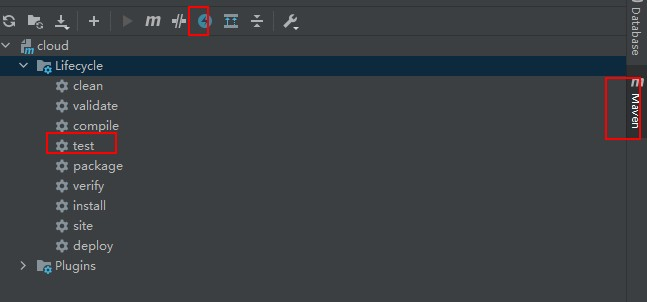

# 零、参考链接

[微服务参考博文](https://blog.csdn.net/u011863024/article/details/114298270)
[SpringCloud中文文档](https://www.springcloud.cc/spring-cloud-greenwich.html)
[Spring Cloud Netflix各组件发音](https://www.csdn.net/tags/NtjaAg1sNzcwMzEtYmxvZwO0O0OO0O0O.html)


# 一、微服务基础理论

## 1.1.什么是微服务

```text
1.微服务是一种架构风格
2.一个应用根据不同业务划分为一组不同的小型服务
3.每个服务运行在独立进程中,可以独立部署和升级,服务可以使用不同的语言和存储技术
4.服务之间通过轻量级的HTTP进行交互
```

## 1.2.微服务的作用是啥,诞生背景(用来解决啥问题)

* 1.耦合/耦合度/解耦/松耦合

```text
1.耦合: 模块与模块之间的相互关联
2.耦合度: 模块与模块之间的相互关联程度
3.解耦: 降低模块与模块之间的关联
4.松耦合: 模块与模块之间相互关联的程度比较低, 其中一个模块修改之后对其他模块影响比较小
```

* 2.微服务优缺点

```text
1.优点：
    1.微服务模块与模块之间关联程度小(松耦合), 可以独立开发和部署, 一个服务故障不会影响到整个应用
    2.微服务每个服务相对较小,功能单一,代码容易理解, 开发人员可以专注于某一块的功能, 有利于团队分工
    3.易于和第三方系统集成, 可以选择不同的语言开发, 根据实际情况使用更合适的技术来实现

2.缺点:
    1.多个服务会带来运维成本的增加,维护困难
    2.随着服务数量的增加, 分布式系统管理的复杂度增加, 数据一致性, 性能监控等 都更难管理
    3.服务之间调用是跨网络的,会增肌网络IO,带来一定的性能损耗
```

* 3.微服务的作用是什么,为什么需要微服务

```text
微服务是为了解决单体应用所存在的问题
1.单体应用所存在的问题
    1.某些功能故障会导致整个应用无法使用, 模块与模块之间耦合度较高, 
    2.部署的时候需要将程序拷贝部署到多台机器上, 如果某个功能修改了, 则所有机器上的程序都需要更新一遍,非常的麻烦
2.微服务的优点
    1.微服务模块与模块之间关联程度小(松耦合), 可以独立开发和部署, 一个服务故障不会影响到整个应用
    2.微服务每个服务相对较小,功能单一,代码容易理解, 开发人员可以专注于某一块的功能, 有利于团队分工
    3.易于和第三方系统集成, 可以选择不同的语言开发, 根据实际情况使用更合适的技术来实现
```

## 1.3.微服务包含哪些具体的技术

```text
1.服务调用
2.服务降级
3.服务注册与发先
4.服务熔断
5.负载均衡
6.服务消息队列
7.服务网关
8.配置中心管理
9.自动化构建部署
10.服务监控
11.全链路追踪
12.服务定时任务
13.调度操作
```

## 1.4.微服务的实际应用场景


## 1.5 SpringCloud

* 1.简介

```text
1.分布式微服务架构的一站式解决方案
2.多种微服务架构落地技术的集合体(微服务全家桶)
```

* 2.SpringCloud集成优质项目推荐
  

* 3.SpringCloud技术栈
  

* 4.SpringCloud大纲
  

## 1.6 实现微服务的两种方式

```text
1.Spring Boot + Spring Cloud. 组件少，功能完备-HTTP通信
2.Spring Boot + Dubbo + zookeeper 组件少，功能非完备 -RPC通信框架

Dubbo: [dʌbəu]
Nacos: 那扣斯
Zookeeper: 美:[ˈzuːkiːpər]
```

# 二、版本选择

## 2.1.如何查看当前项目所使用的SpringBoot 和 Spring版本

```text
f1: 通过API获取
    String version = SpringBootVersion.getVersion();
    String version1 = SpringVersion.getVersion();
    
f2:查看pom.xml中父项目的版本
    <parent>
        <groupId>org.springframework.boot</groupId>
        <artifactId>spring-boot-starter-parent</artifactId>
        <!-- 这里对应的就是SpringBoot的版本 -->
        <version>2.6.6</version>
        <relativePath/> 
    </parent>
```

## 2.2.IDEA创建SpringBoot项目时的问题

```text
q: https://start.spring.io/连接不上
j: 替换为: https://start.aliyun.com (但是这个所使用的springboot版本比较低, 例如spring.io使用的最新的2.7版本, 但是aliyun使用的是2.3.x的版本)
```

## 2.3.SpringBoot和SpringCloud版本选择

* 1.SpringBoot源码地址 和 官网版本显示页
  [SpringBoot源码地址](https://github.com/spring-projects/spring-boot/releases/)
  [SpringBoot官网版本页面](https://spring.io/projects/spring-boot#learn)

* 2.SpringCloud源码地址 和 官网版本显示页
  [SpringCloud源码地址](https://github.com/spring-projects/spring-cloud)
  [SpringCloud官网版本页面](https://spring.io/projects/spring-cloud#learn)
  [Spring Cloud Alibaba](https://spring.io/projects/spring-cloud-alibaba#learn)

* 3.SpringBoot与SpringCloud兼容性查看
  [官方文档](https://spring.io/projects/spring-cloud#adding-spring-cloud-to-an-existing-spring-boot-application)
  [JSON-API](https://start.spring.io/actuator/info)

* 4.总结

```text
1.最新版的SpringCloud 与 SpringBoot兼容性:
    SpringCloud: 2021.0.x aka Jubilee
    SpringBoot: 2.6.x

2.最终选择
    SpringCloud: 选择最新的稳定发行版(GA): 2021.0.2 GA
    SpringBoot: 选择兼容SpringCloud2021.0.x的最新稳定发行版: 2.6.8
    Spring Cloud Alibaba: 2021.1 TODO
```

# 三、Cloud各组件 停更/升级/替换

[SpringCloud中文文档](https://www.bookstack.cn/read/spring-cloud-docs/docs-index.md)
[SpringCloud官方文档](https://docs.spring.io/spring-cloud/docs/current/reference/html/)
[SpringBoot官方文档](https://docs.spring.io/spring-boot/docs/2.6.8/reference/htmlsingle/)
[Spring Cloud 组件停更说明](https://blog.csdn.net/justlpf/article/details/115404006)

* 1.服务注册中心 × Eureka √ Zookeeper √ Consul √ Nacos

* 2.服务调用 √ Ribbon √ LoadBalancer

* 3.服务调用2 × Feign √ OpenFeign

* 4.服务降级 × Hystrix √ resilience4j √ sentienl

* 5.服务网关 × Zuul
  ! Zuul2 √ gateway

* 6.服务配置 × Config √ Nacos

* 7.服务总线 × Bus √ Nacos

# 四、微服务架构项目构建

## 4.1 什么是约定>配置>编码

```text
1.约定就是默认配置, 配置指自定义配置,
约定>配置>编码 说的是 能使用默认配置就是用默认配置, 如果有特殊需求且可以通过配置完成就自定义配置, 最后才通过编程实现

好处: 减少开发工作量(使用约定就是减少配置, 自定义配置就是减少编码量)
```

## 4.2 创建微服务项目父工程

* 1.创建步骤

```text
N: (创建的目录过于复杂)

File -> new -> project -> maven -> create from archetype -> 选择maven-archetype-site (复杂网站)
archetype: 美 [ˈɑːrkitaɪp]  原型(表示项目模板的意思)
```

* 2.maven提供的41个原型

```text
1: appfuse-basic-jsf (创建一个基于Hibernate，Spring和JSF的Web应用程序的原型) 
2: appfuse-basic-spring(创建一个基于Hibernate，Spring和Spring MVC的Web应用程序的原型) 
3: appfuse-basic-struts(创建一个基于Hibernate，Spring和Struts 2的Web应用程序的原型) 
4: appfuse-basic-tapestry(创建一个基于Hibernate，Spring 和 Tapestry 4的Web应用程序的原型) 
5: appfuse-core(创建一个基于Hibernate，Spring 和 XFire的jar应用程序的原型) 
6: appfuse-modular-jsf(创建一个基于Hibernate，Spring和JSF的模块化应用原型) 
7: appfuse-modular-spring(创建一个基于Hibernate, Spring 和 Spring MVC 的模块化应用原型) 
8: appfuse-modular-struts(创建一个基于Hibernate, Spring 和 Struts 2 的模块化应用原型) 
9: appfuse-modular-tapestry (创建一个基于 Hibernate, Spring 和 Tapestry 4 的模块化应用原型) 
10: maven-archetype-j2ee-simple(一个简单的J2EE的Java应用程序) 
11: maven-archetype-marmalade-mojo(一个Maven的 插件开发项目 using marmalade) 
12: maven-archetype-mojo(一个Maven的Java插件开发项目) 
13: maven-archetype-portlet(一个简单的portlet应用程序) 
14: maven-archetype-profiles() 
15:maven-archetype-quickstart() 
16: maven-archetype-site-simple(简单的网站生成项目) 
17: maven-archetype-site(更复杂的网站项目) 
18:maven-archetype-webapp(一个简单的Java Web应用程序) 
19: jini-service-archetype(Archetype for Jini service project creation) 
20: softeu-archetype-seam(JSF+Facelets+Seam Archetype) 
21: softeu-archetype-seam-simple(JSF+Facelets+Seam (无残留) 原型) 
22: softeu-archetype-jsf(JSF+Facelets 原型) 
23: jpa-maven-archetype(JPA 应用程序) 
24: spring-osgi-bundle-archetype(Spring-OSGi 原型) 
25: confluence-plugin-archetype(Atlassian 聚合插件原型) 
26: jira-plugin-archetype(Atlassian JIRA 插件原型) 
27: maven-archetype-har(Hibernate 存档) 
28: maven-archetype-sar(JBoss 服务存档) 
29: wicket-archetype-quickstart(一个简单的Apache Wicket的项目) 
30: scala-archetype-simple(一个简单的scala的项目) 
31: lift-archetype-blank(一个 blank/empty liftweb 项目) 
32: lift-archetype-basic(基本（liftweb）项目) 
33: cocoon-22-archetype-block-plain([http://cocoapacorg2/maven-plugins/]) 
34: cocoon-22-archetype-block([http://cocoapacorg2/maven-plugins/]) 
35:cocoon-22-archetype-webapp([http://cocoapacorg2/maven-plugins/]) 
36: myfaces-archetype-helloworld(使用MyFaces的一个简单的原型) 
37: myfaces-archetype-helloworld-facelets(一个使用MyFaces和Facelets的简单原型) 
38: myfaces-archetype-trinidad(一个使用MyFaces和Trinidad的简单原型) 
39: myfaces-archetype-jsfcomponents(一种使用MyFaces创建定制JSF组件的简单的原型) 
40: gmaven-archetype-basic(Groovy的基本原型) 
41: gmaven-archetype-mojo(Groovy mojo 原型)
```

* 3.maven仓库地址 (搜索依赖对应的最新版本)

```text
maven官网仓库地址: https://mvnrepository.com/
```

* 4.pom.xml配置时遇到的坑 Dependency 'mysql:mysql-connector-java' not found

```text
1.IDEA的maven安装程序设置错误
    File | Settings | Build, Execution, Deployment | Build Tools | Maven
2.错误的使用了 <dependencyManagement>
    1.如果一开始就是用<dependencyManagement>, 则所有依赖的最新版本IDEA都不会给你提示(正常情况下会有提示)
    2.先不使用<dependencyManagement> (注释掉), 然后根据IDEA提示将所有依赖设置为最新版本后下载
    3.最后再加上<dependencyManagement>
```

* 5.新建微服务父工程
* 前言: 首先需要新建一个maven父工程，父工程下新建多个模块，每一个模块都是一个maven项目，对应一个微服务模块

```text
1.新建父工程步骤:
File -> New -> Project -> Maven -> create from archetype -> maven-archetype-site -> 选择maven版本 -> 设置groupId等信息

2.IDEA设置
    1.开启注解处理(annotation process): Lombok 美['lɔmbɔk] 可以通过注解为实体类生成代码, 例如@Data 就相当于为实体类生成了get/set/xxx 等方法 
        File | Settings | Build, Execution, Deployment | Compiler | Annotation Processors -> Enable annotation processing
    2.设置编译使用java8: File | Settings | Build, Execution, Deployment | Compiler | Java Compiler -> 8
    3.设置文件编码: File | Settings | Editor | File Encodings
    4.设置不显示项目中某些后缀名的文件: File | Settings | Editor | File Types
    
3.父项目中的SpringBoot/SpringCloud/SpringCloud alibaba依赖
    <!--spring boot 2.6.8
        spring-boot-dependencies包含了开发常用的各种依赖及其版本号
    -->
    <dependency>
        <groupId>org.springframework.boot</groupId>
        <artifactId>spring-boot-dependencies</artifactId>
        <version>2.6.8</version>
        <type>pom</type>
        <scope>import</scope>
    </dependency>
    <!--spring cloud 2021.0.2-->
    <dependency>
        <groupId>org.springframework.cloud</groupId>
        <artifactId>spring-cloud-dependencies</artifactId>
        <version>2021.0.2</version>
        <type>pom</type>
        <scope>import</scope>
    </dependency>
    <!--spring cloud alibaba 2021.1-->
    <dependency>
        <groupId>com.alibaba.cloud</groupId>
        <artifactId>spring-cloud-alibaba-dependencies</artifactId>
        <version>2021.1</version>
        <type>pom</type>
        <scope>import</scope>
    </dependency>
```

* 6.<dependencyManagement>标签

```text
1.作用
    1.maven通过<dependencyManagement>元素来管理依赖的版本号
    2.在父项目中使用该标签,声明依赖和对应的版本号, 在子项目中可以直接声明依赖而不指定版本号,从父pom.xml中继承该依赖的版本号
        N1: dependencyManagement只声明依赖但不引入, 子项目需要显示声明所使用的依赖
        N2: 如果子项目中指定了依赖的版本号,则使用指定的, 否则从父pom.xml中继承(version/scope/type 均从父pom中继承)
    3.示例
        1.父pom.xml
          <dependencyManagement>
              <dependencies>
                  <dependency>
                  <groupId>mysq1</groupId>
                  <artifactId>mysql-connector-java</artifactId>
                  <version>5.1.2</version>
                  </dependency>
              <dependencies>
          </dependencyManagement>
          
        2.子pom.xml (直接声明引来,不需要指定版本号)
          <dependencies>
              <dependency>
              <groupId>mysq1</groupId>
              <artifactId>mysql-connector-java</artifactId>
              </dependency>
          </dependencies>
          
2.好处
    1.如果有多个子项目都需要引入同一个依赖,则可以避免在每个项目中都声明一个版本号
    2.需要修改版本号的时候只要修改父pom.xml文件中的版本号即可, 避免在每个子项目的pom中都修改一次
    
3.运行maven
    1.IDEA右侧旁的Maven插件有Toggle ' Skip Tests' Mode按钮，这样maven可以跳过单元测试
    2.父工程创建完成执行 mvn:install 将父工程发布到仓库方便子工程继承
```



* 7.创建子项目

```text
1.微服务组件
  spring-cloud-starter-zipkin: 请求链路追踪, 将请求经过的路径全都记录下来  
      0.包含了sleuth+zipkin
      1.链路追踪器: sleuth 美[sluːθ]
      2.是可视化的链路分析器: zipkin ['zɪp kɪn]
  spring-cloud-starter-netflix-eureka-client: eureka客户端, 服务注册与发现

2.springboot组件
    spring-boot-starter-web: 包含web开发常用依赖
    spring-boot-starter-actuator 可以用于检测系统的健康情况、当前的Beans、系统的缓存等

3.数据库操作相关组件
  mybatis-spring-boot-starter
  druid-spring-boot-starter
  mysql-connector-java
  spring-boot-starter-jdbc

4.热部署(ctrl+f9)
    spring-boot-devtools

5.开启注解处理(@Data等注解为实体类生成代码(get/set/xxx等))
    lombok

6.测试
    spring-boot-starter-test

    <!--包含了sleuth+zipkin
      sleuth: 美[sluːθ] 链路追踪器
      zipkin: ['zɪp kɪn] 可视化的链路分析器
    -->
    <dependency>
        <groupId>org.springframework.cloud</groupId>
        <artifactId>spring-cloud-starter-zipkin</artifactId>
    </dependency>
    <!--eureka-client
        eureka: [juˈriːkə] 服务注册与发现
    -->
    <dependency>
        <groupId>org.springframework.cloud</groupId>
        <artifactId>spring-cloud-starter-netflix-eureka-client</artifactId>
    </dependency>
    <!-- 引入自己定义的api通用包，可以使用Payment支付Entity -->
    <!--
    <dependency>
        <groupId>com.atguigu.springcloud</groupId>
        <artifactId>cloud-api-commons</artifactId>
        <version>${project.version}</version>
    </dependency>
    -->

    <!--
      1.spring-boot-starter-web: 包含web开发常用依赖及版本号
      2.spring-boot-starter-actuator: 
    -->
    <dependency>
        <groupId>org.springframework.boot</groupId>
        <artifactId>spring-boot-starter-web</artifactId>
    </dependency>
    <dependency>
        <groupId>org.springframework.boot</groupId>
        <artifactId>spring-boot-starter-actuator</artifactId>
    </dependency>

    <!--数据库操作相关依赖-->
    <dependency>
        <groupId>org.mybatis.spring.boot</groupId>
        <artifactId>mybatis-spring-boot-starter</artifactId>
    </dependency>
    <dependency>
        <groupId>com.alibaba</groupId>
        <artifactId>druid-spring-boot-starter</artifactId>
        <version>1.1.10</version>
    </dependency>
    <!--mysql-connector-java-->
    <dependency>
        <groupId>mysql</groupId>
        <artifactId>mysql-connector-java</artifactId>
    </dependency>
    <!--jdbc-->
    <dependency>
        <groupId>org.springframework.boot</groupId>
        <artifactId>spring-boot-starter-jdbc</artifactId>
    </dependency>

    <!--devtools 用于热部署(ctrl+f9)-->
    <dependency>
        <groupId>org.springframework.boot</groupId>
        <artifactId>spring-boot-devtools</artifactId>
        <scope>runtime</scope>
        <optional>true</optional>
    </dependency>

    <!--Lombok: 开启注解处理, 通过@Data等注解可以为实体类生成代码(get/set/xxx等)
     IDEA需要设置: File | Settings | Build, Execution, Deployment | Compiler | Annotation Processors -> Enable annotation processing
     -->
    <dependency>
        <groupId>org.projectlombok</groupId>
        <artifactId>lombok</artifactId>
        <optional>true</optional>
    </dependency>

    <!--测试程序-->
    <dependency>
        <groupId>org.springframework.boot</groupId>
        <artifactId>spring-boot-starter-test</artifactId>
        <scope>test</scope>
    </dependency>
```

[SpringBoot场景启动器](https://docs.spring.io/spring-boot/docs/current/reference/html/using-spring-boot.html#using-boot-starter)

* 8.IDEA的maven配置遇到的坑

```text
1.每次新建项目, maven使用的都是C盘的maven
    j: 设置默认maven为自己安装的maven
        File -> New Projects Setup -> Settings For New Project ->
            -> maven设置
            -> java compiler设置
            -> File Encoding设置
            
            
2.Could not find artifact org.springframework.cloud:spring-cloud-starter-zipkin
    如果遇到版本不兼容, 则先去https://mvnrepository.com/中查找依赖的最新版本号,然后显示指定
    <dependency>
        <groupId>org.springframework.cloud</groupId>
        <artifactId>spring-cloud-starter-zipkin</artifactId>
        <version>2.2.8.RELEASE</version>
    </dependency>
    
3.Cannot resolve org.springframework.cloud:spring-cloud-starter-netflix-eureka-client:pom:3.1.2 failed to transfer from https://repo.maven.apache.org/maven2 during a previous attempt. This failure was cached in the local repository and resolution is not reattempted until the update interval of central has elapsed or updates are forced. Original error: Could not transfer artifact org.springframework.cloud:spring-cloud-starter-netflix-eureka-client:pom:3.1.2 from/to central (https://repo.maven.apache.org/maven2): 
    transfer failed for https://repo.maven.apache.org/maven2/org/springframework/cloud/spring-cloud-starter-netflix-eureka-client/3.1.2/spring-cloud-starter-netflix-eureka-client-3.1.2.pom
    
    看到maven仓库地址为: https://repo.maven.apache.org/ 则说明用的不是自己安装的maven(自己安装的使用的是阿里云的镜像)
    J: 将项目的maven设置为 自己安装的maven
```

* 9.子项目创建流程

```text
0.先设置IDEA默认使用的maven
1.创建maven工程
2.修改子项目的pom.xml文件
3.resources/application.yaml 文件配置  TODO: 如何知道springboot有哪些配置
4.创建主程序


yaml配置:
server:
  port: 8001

spring:
  application:
    # 服务名不能包含下划线,否则Eureka不能识别
    name: cloud-payment-service
  datasource:
    type: com.alibaba.druid.pool.DruidDataSource            # 当前数据源操作类型
    driver-class-name: org.gjt.mm.mysql.Driver              # mysql驱动包
    url: jdbc:mysql://localhost:3306/my?useUnicode=true&characterEncoding=utf-8&useSSL=false
    username: root
    password: 1234

mybatis:
  mapperLocations: classpath:mapper/*.xml
  type-aliases-package: com.cloud.entities    # 所有Entity别名类所在包  TODO:类和xml匹配的机制
```

* 10.调用接口时如何找到对应的sql语句

```text
1.首先会根据application.yaml中设置的mapperLocations 找到所有映射文件并加载
2.以映射文件中的 命名空间.标签ID值 作为key(对应的是接口中方法的全限定名)
3.以标签中的sql作为value 进行键值对的映射
4.当调用某个接口时,就根据接口的全限定名去键值对中取,如果存在则执行对应的sql
```

* 11.热部署 N: 开发环境使用热部署，生产环境必须停用!!!!
* Jrebel: J['rebəl ]

```text
TODO: 开发环境使用热部署，生产环境必须停用!!!!
1.IDEA plugin -> 安装Jrebel插件 -> 重启IDEA
    Jrebel激活: 
        1.生成GUID: https://www.guidgen.com/
        2.激活链接: https://jrebel.qekang.com/<生成的GUID>
        
2.File | Settings | Build, Execution, Deployment | Compiler -> 4.3.设置自动build项目.png
3.File | Settings | Advanced Settings -> 4.4.auto-make.png

N: Jrebel和Xrebel的区别
    1.Jrebel: 用于热部署
    2.Xrebel: 对请求中各部分代码性能进行监控(方法执行时间，出现的异常，SQL执行时间，输出的Log，MQ执行时间等)
    
    
TODO: xml文件热部署不生效 => Jrebel MybatisPlus extension
TODO: 对yaml文件修改不生效
```


* 12.总结:创建微服务模块的套路

```text
1.建Module
2.改POM
3.写YML
4.主启动
5.业务类
```

* 13.RestTemplate发送客户端HTTP请求
  [RestTemplate文档](https://docs.spring.io/spring-framework/docs/5.2.2.RELEASE/javadoc-api/org/springframework/web/client/RestTemplate.html)

```text
1.postForObject(url, 请求参数, 返回的响应体内容类型的class类对象)
    @GetMapping("/consumer/create")
    public CommonResult<Integer> create(Payment payment) {
        // 发送post请求
        return restTemplate.postForObject(paymentUrl + "/payment/create", payment, CommonResult.class);
    }
    
2.getForObject(url, 返回的响应体类型的class对象)  
    @GetMapping("/consumer/get/{id}")
    public CommonResult<Payment> getPaymentById(@PathVariable("id") String id) {
        // 发送get请求
        return restTemplate.getForObject(paymentUrl + "/payment/" + id, CommonResult.class);
    }
    
3.postForEntity(url, 请求参数, 返回的响应体内容类型的class类对象)
    @GetMapping("/consumer/create")
    public CommonResult<Integer> create(Payment payment) {
        // 发送post请求
        return restTemplate.postForObject(paymentUrl + "/payment/create", payment, CommonResult.class);
    }

4.getForEntity(url, 返回的响应体类型的class对象)
    @GetMapping("/consumer/get/{id}")
    public CommonResult<Payment> getPaymentById(@PathVariable("id") String id) {
        // 发送get请求
        return restTemplate.getForObject(paymentUrl + "/payment/" + id, CommonResult.class);
    }
    
    // getForEntity 返回ResponseEntity对象
    @GetMapping("/consumer/getForEntity/{id}")
    public CommonResult<Payment> getPaymentByEntity(@PathVariable("id") String id) {
        ResponseEntity<CommonResult> resp = restTemplate.getForEntity(paymentUrl+"/payment/"+id, CommonResult.class);

        if(resp.getStatusCode().is2xxSuccessful()) {
            log.info(resp.getStatusCode().toString());
            return resp.getBody();
        } else {
            return new CommonResult<>(444, "操作失败");
        }
    }
    
N: 返回值的区别
    1.xxxForObject: 返回响应体转换成的对象
    2.xxxForEntity: 返回ResponseEntity对象 (包含返回响应的响应头信息)
                    ResponseEntity<CommonResult> 表示响应体类型为CommonResult
        N: ResponseEntity.getStatusCode() => 获取Http状态码和原因短语
            ResponseEntity.getStatusCode().is2xxSuccessful() 判断是否是2xx的状态码
```

* 14.泛型的class类对象

```text
1.一般类的class对象: 类型.class
2.泛型信息在编译期有效, 在运行期被删除,所以泛型所有参数在编译后都会被清除, 所以无论泛型的参数化类型是什么, 他的class对象都是原始类型的class对象
    例如 List<String> 对应的 class对象为 List.class
```

* 15.目录结构 N: tree /f

```text
D:.
│  PaymentMain8001.java
│
├─controller
│      PaymentController.java
│
├─dao
│      PaymentDao.java
│
└─service
    │  PaymentService.java
    │
    └─impl
            PaymentServiceImpl.java

```

# 五、Eureka 服务注册与发现

* [juˈriːkə] 找到了/发现了

## 5.1 Eureka基础知识

### 5.1.1 什么是Eureka

```text
1.Netflix开发的服务发现与注册框架
2.SpringCloud将其集成来实现服务治理
        <dependency>
            <groupId>org.springframework.cloud</groupId>
            <artifactId>spring-cloud-starter-netflix-eureka-server</artifactId>
        </dependency>
```

### 5.1.2 什么是服务治理

```text
用来管理服务与服务之间的依赖关系, 实现服务调用/负载均衡/容错/服务发现与注册
    N: 例如服务A调用了服务B, 但是一旦B的地址修改了,则需要手动修改A的RPC远程调用地址; 通过服务治理可以动态的进行修改
```

### 5.1.3 什么是服务注册与发现

```text
1.首先有一个注册中心,所有的服务启动以后会把当前的服务器信息,例如通信地址以别名的方式注册到注册中心
2.当服务消费者需要调用其他服务时, 以别名的方式从注册中心中取到对应的通信地址,再通过哦RPC进行远程调用

服务注册: 将服务信息(例如服务节点的通信地址)注册到注册中心 (别名作为key, 服务信息作为value)
服务发现: 从注册中心获取服务信息
```

### 5.1.4.Eureka的架构和dubbo的架构


### 5.1.5.Eureka的两个组件

```text
1.Eureka Server: 提供服务注册功能
    每个微服务节点通过配置启动后,会将自己的服务地址信息在Eureka Server中进行注册,Eureka Server会存储所有可用的服务节点的信息
    可通过界面直接查看: 
2.Eureka Client: 提供服务发现功能
    它是一个Java客户端，用于简化Eureka Server的交互，客户端同时也具备一个内置的, 使用轮询(round-robin)负载算法的负载均衡器。
    1.在应用启动后，Eureka Client每过30s会向Eureka Server发送一次心跳包
    2.如果Eureka Server在90s内没有接收到某个节点的心跳包，Eureka Server会从服务注册表中将该服务节点移除
    3.TODO: 但是如果在短时间内丢失了大量服务实例的心跳，这时候EurekaServer就会开启自我保护机制，不会剔除服务
```

## 5.2 EurekaServer服务端安装(配置注册中心)

### 5.2.1 添加依赖

```text
<dependency>
    <groupId>org.springframework.cloud</groupId>
    <artifactId>spring-cloud-starter-netflix-eureka-server</artifactId>
</dependency>
        
N: Eureka Server使用的是spring-cloud-starter-netflix-eureka-server
    Eureka Client使用的是spring-cloud-starter-netflix-eureka-client
```

### 5.2.2 配置yaml

```text
server:
  port: 7001

eureka:
  instance:
    hostname: locathost # eureka服务端的实例名称
  client:
    # false表示不向注册中心注册自己。
    register-with-eureka: false
    # false表示自己端就是注册中心，我的职责就是维护服务实例，并不需要去检索服务
    fetch-registry: false
    # 设置注册中心集群地址
    service-url:
      # 设置与Eureka server交互的地址查询服务和注册服务都需要依赖这个地址。
      defaultZone: http://${eureka.instance.hostname}:${server.port}/eureka/
```

### 5.2.3 主程序

* ＠EnableEurekaServer: 声明一个Eureka Server

```text
@SpringBootApplication
@EnableEurekaServer // 声明Eureka服务器
public class EurekaMain7001 {
    public static void main(String[] args) {
        SpringApplication.run(EurekaMain7001.class, args);
    }
}
```

[访问Spring Eureka界面](http://localhost:7001/)

## 5.3 创建Eureka Client

### 5.3.1 添加Eureka Client依赖

```text
<dependency>
    <groupId>org.springframework.cloud</groupId>
    <artifactId>spring-cloud-starter-netflix-eureka-client</artifactId>
</dependency>
```

### 5.3.2 Eureka Client的yaml配置

```text
eureka:
  client:
    # 表示是否将自己注册进EurekaServer默认为true。
    register-with-eureka: true
    # 是否从EurekaServer抓取已有的注册信息，默认为true。单节点无所谓，集群必须设置为true才能配合ribbon使用负载均衡
    fetchRegistry: true
    service-url:
      # 单机版
      defaultZone: http://localhost:7001/eureka
      # 集群版
      # defaultZone: http://eureka7001.com:7001/eureka,http://eureka7002.com:7002/eureka
  instance:
    instance-id: payment8001
    # 访问路径可以显示IP地址
    prefer-ip-address: true
    # Eureka客户端向服务端发送心跳的时间间隔，单位为秒(默认是30秒)
    # lease-renewal-interval-in-seconds: 1
    # Eureka服务端接收心跳包的超时时间, 默认是90秒, 90秒内没收到心跳包则将服务剔除
    # lease-expiration-duration-in-seconds: 2
```

### 5.3.3 通过@EnableEurakeClient将服务声明为一个Eureka客户端

```text
@SpringBootApplication
@EnableEurekaClient // 将该服务声明为Eureka客户端
public class PaymentMain8001 {
    public static void main(String[] args) {
        SpringApplication.run(PaymentMain8001.class, args);
    }
}
```

## 5.4 Eureka集群原理

```text
1.Eureka Server启动,作为注册中心
2.启动服务提供者,服务提供者会将服务信息(例如通讯地址等)以别名的方式注册到注册中心
3.服务消费者需要调用其他服务时,通过别名从注册中心获取对应的服务通讯地址
4.然后再使用HttpClient对该通信地址进行RPC调用
5.消费者获得服务地址后会缓存在本地JVM中,每隔30s刷新一次
```

## 5.5 微服务RPC远程服务调用最核心问题

* 高可用!!!

```text
q: 如果注册中心只有一个,当它出故障,会导致整个服务集群不可用
J: 构建Eureka集群,实现 负载均衡+故障容错
```

## 5.6 设置注册中心集群

### 5.6.1 设置多个Eureka Server服务

```text
# Eureka Server节点一: cloud-eureka-server7001
server:
  port: 7001

eureka:
  instance:
    hostname: eureka7001.com # eureka服务端的实例名称
  client:
    # false表示不向注册中心注册自己。
    register-with-eureka: false
    # false表示自己端就是注册中心，我的职责就是维护服务实例，并不需要去检索服务
    fetch-registry: false
    service-url:
      # 设置与Eureka server交互的地址查询服务和注册服务都需要依赖这个地址。
      defaultZone: http://${eureka.instance.hostname}:${server.port}/eureka/
      
# Eureka Server节点二: cloud-eureka-server7002
server:
  port: 7002

eureka:
  instance:
    hostname: eureka7002.com # eureka服务端的实例名称
  client:
    # false表示不向注册中心注册自己。
    register-with-eureka: false
    # false表示自己端就是注册中心，我的职责就是维护服务实例，并不需要去检索服务
    fetch-registry: false
    service-url:
      # 设置与Eureka server交互的地址查询服务和注册服务都需要依赖这个地址。
      defaultZone: http://${eureka.instance.hostname}:${server.port}/eureka/      
```

### 5.6.2 在服务生产者节点设置 注册中心集群地址

* 这样两个注册中心都将有cloud-payment-service的注册信息

```text
# cloud-payment-service
eureka:
  client:
    # 表示是否将自己注册进EurekaServer默认为true。
    register-with-eureka: true
    # 是否从EurekaServer抓取已有的注册信息，默认为true。单节点无所谓，集群必须设置为true才能配合ribbon使用负载均衡
    fetchRegistry: true
    # 设置注册中心集群地址
    service-url:
      # 单机版
      # defaultZone: http://localhost:7001/eureka
      # 集群版: 设置注册中心的集群的地址
      defaultZone: http://eureka7001.com:7001/eureka,http://eureka7002.com:7002/eureka
  instance:
    instance-id: payment8001
    # 访问路径可以显示IP地址
    prefer-ip-address: true
    # Eureka客户端向服务端发送心跳的时间间隔，单位为秒(默认是30秒)
    # lease-renewal-interval-in-seconds: 1
    # Eureka服务端在收到最后一次心跳后等待时间上限，单位为秒(默认是90秒)，超时将剔除服务
    # lease-expiration-duration-in-seconds: 2
```

## 5.7 在服务消费节点开启负载均衡

### 5.7.0 部署多个服务生产者

```text
cloud-provider-service8001/cloud-provider-service8002
```

### 5.7.1 在cloud-consumer-order80服务的config/MyApplicationConfig中开启负载均衡

```text
@Configuration // 将类声明为一个配置类: 1.注册一个该类的组件到容器中, 2.默认为Full模式,类中被@Bean修改的方法无论调用多少次都返回同一个实例
public class MyApplicationConfig {
    @Bean // 将方法返回值作为一个组件添加到容器中
    @LoadBalanced // 使RestTemplate拥有负载均衡的功能, 发送请求时候可以轮询选择对哪一个地址发送请求
    public RestTemplate getRestTemplate() {
        return new RestTemplate();
    }
}
```

### 5.7.2 服务请求地址以服务提供者的spring.application.name命名

```text
// 这里请求的服务地址"cloud-payment-service"是在对应的服务中的application.yaml中配置的spring.application.name
// 可以全大写或全小写(其他则不行)
@Value("http://cloud-payment-service")
private String paymentUrl;

@GetMapping("/consumer/get/{id}")
public CommonResult<Payment> getPaymentById(@PathVariable("id") String id) {
    return restTemplate.getForObject(paymentUrl + "/payment/" + id, CommonResult.class);
}

N: 之后请求 http://localhost/consumer/get/1 返回响应中包含的端口信息,8001/8002将交替出现
```

## 5.8 完善微服务的信息

* 在cloud-provider-service8001 和 cloud-provider-service8002中添加eureka.instance配置

```text
eureka:
  client:
    # 表示是否将自己注册进EurekaServer默认为true。
    register-with-eureka: true
    # 是否从EurekaServer抓取已有的注册信息，默认为true。单节点无所谓，集群必须设置为true才能配合ribbon使用负载均衡
    fetchRegistry: true
    # 设置注册中心集群地址
    service-url:
      # 单机版
      # defaultZone: http://localhost:7001/eureka
      # 集群版
      defaultZone: http://eureka7001.com:7001/eureka,http://eureka7002.com:7002/eureka
  instance:
    # Eureka界面上默认显示的服务对应的实例ID为: 主机名:服务名(就是spring.application.name):端口号
    # 例如: iwencai-10-21-97:cloud-order-service:80
    instance-id: payment8002
    # 将鼠标放到Eureka界面的payment8002上, 会显示出对应的链接地址
    # 例如: http://10.10.21.97:8002/actuator/info
    prefer-ip-address: true
    # Eureka客户端向服务端发送心跳的时间间隔，单位为秒(默认是30秒)
    # lease-renewal-interval-in-seconds: 1
    # Eureka服务端在收到最后一次心跳后等待时间上限，单位为秒(默认是90秒)，超时将剔除服务
    # lease-expiration-duration-in-seconds: 2
```

## 5.9 服务发现

```text
1.导入SpringCloud的DiscoveryClient/ServiceInstance包
  import org.springframework.cloud.client.ServiceInstance;
  import org.springframework.cloud.client.discovery.DiscoveryClient;
  
2.从注册中心获取所有服务名
    List<String> services = discoveryClient.getServices();
    
3.从注册中心获取指定服务名对应的实例列表
    List<ServiceInstance> instances = discoveryClient.getInstances("cloud-payment-service");
    
    // serviceId:CLOUD-PAYMENT-SERVICE, host:10.10.21.97, port:8001, uri:http://10.10.21.97:8001
    // serviceId:CLOUD-PAYMENT-SERVICE, host:10.10.21.97, port:8002, uri:http://10.10.21.97:8002
    instance.getServiceId(): 服务ID
    instance.getHost(): IP
    instance.getPort(): 端口
    instance.getUri(): uri
    
    N: log.info("{}, {}, {}", xx, xx, xx) => 通过{}来设置占位符

// 服务发现
@GetMapping("/payment/discovery")
public Object discovery() {
    // 获取所有的服务名
    List<String> services = discoveryClient.getServices();
    // service: cloud-order-service
    // service: cloud-payment-service
    for (String service : services) {
        log.info("service: " + service);
    }

    // 获取某个服务的所有实例
    List<ServiceInstance> instances = discoveryClient.getInstances("cloud-payment-service");
    // serviceId:CLOUD-PAYMENT-SERVICE, host:10.10.21.97, port:8001, uri:http://10.10.21.97:8001
    // serviceId:CLOUD-PAYMENT-SERVICE, host:10.10.21.97, port:8002, uri:http://10.10.21.97:8002
    for (ServiceInstance instance : instances) {
        log.info("serviceId:{}, host:{}, port:{}, uri:{}",
                instance.getServiceId(),
                instance.getHost(),
                instance.getPort(),
                instance.getUri()
        );
    }

    // {
    // 	"services": [
    // 		"cloud-order-service",
    // 		"cloud-payment-service"
    // 	],
    // 	"order": 0
    // }
    return this.discoveryClient;
}
```

## 5.10 Eureka自我保护机制

[Eureka心跳续约和自我保护机制](https://blog.csdn.net/Bad_Ape/article/details/122669454)
[自我保护机制](https://www.jdon.com/springcloud/eureka-self-preservation.html)
[自我保护机制](https://blog.csdn.net/qq_38392777/article/details/123393233)

### 5.10.1 什么是Eureka自我保护机制和原理

```text
1.默认情况下,Eureka Client每30s会向Eureka Server发送一次心跳包
2.Eureka Server每隔60s会检查所有服务上一次发送的心跳包被Eureka Server收到后距离现在经过了多长时间(续约超时时间)
3.如果超过90s就会剔除该服务
4.但是如果有大量服务的心跳丢失了, Eureka Server不会剔除这些服务, 这就是自我保护机制
5.自我保护机制的目的 => 见5.10.2

# Eureka Client:
eureka:
  instance:
  	# 如果x秒内，定依然没有收到续约请求，判服务过期,默认90s
  	# 注意，Eureka　Server每经过eviction-interval-timer-in-ms指定的时间就会检查所有服务上一次发送的心跳包被Eureka　Server接受后，
  	# 距离现在经过的时间，如果超过lease-expiration-duration-in-seconds所指定的时间，才会删除该服务
    lease-expiration-duration-in-seconds: 50
    # 每隔x秒钟，向服务中心发送一条续约指令,默认30s
    lease-renewal-interval-in-seconds: 30

# Eureka Server
eureka:
  server:
  	# 为方便测试，我们强制关闭服务自保功能
    enable-self-preservation: false
    # 每隔多久（ms）触发一次服务剔除
    eviction-interval-timer-in-ms: 10000

```

### 5.10.2 自我保护机制的目的是什么(作用)

```text
1.当发生网络故障导致大量服务无法与Eureka Server进行通信时,此时Eureka Server无法接受到这些服务发送的心跳
2.但这些服务本身仍然可以正常运行,所以如果一味的剔除这些服务则会反而会导致服务不可用
(例如服务A调用了服务B,如果Eureka Server剔除了服务B,则服务A无法再从Eureka Server中获取到B的通信地址,也就导致服务A不可用了)
3.所以自我保护机制其实就是尽可能的保留那些可能正常的服务
```

### 5.10.3 如何判断Eureka进入自我保护模式

* 自我保护机制默认是开启的

```text
当Eukeka进入自我保护模式时, 会显示:
    EMERGENCY! EUREKA MAY BE INCORRECTLY CLAIMING INSTANCES ARE UP WHEN THEY’RE NOT. RENEWALS ARELESSER THAN THRESHOLD AND HENCFT ARE NOT BEING EXPIRED JUST TO BE SAFE.
    紧急情况！EUREKA可能错误地声称实例在没有启动的情况下启动了。续订小于阈值，因此实例不会为了安全而过期。

```

### 5.10.4 Eureka如何禁用自我保护模式

```text
# 下面这两个配置项需要在Eureka Server端配置
eureka:
  server:
    # 关闭自我保护机制，保证不可用服务被及时踢除
    enable-self-preservation: false
    # 设置每2000ms进行一次服务剔除
    eviction-interval-timer-in-ms: 2000

N: 如果Eureka Server进入了自我保护模式，Spring-Eureka 界面会显示:
    THE SELF PRESERVATION MODE IS TURNED OFF. THIS MAY NOT PROTECT INSTANCE EXPIRY IN CASE OF NETWORK/OTHER PROBLEMS.
```

### 5.10.5 什么时候禁用自我保护

```text
1.开发/测试 时禁用
    N:因为可能需要不断的开启或关闭实例，这样就很容易触发保护模式，这样在调试时发生问题的实例
    会因为保护模式而无法被删除，排查问题就会更困难(因为如果有问题的实例如果被删除，那么我根据
    Spring-Eureka界面就能直观的看到哪些服务被删除了，从而更快的找到问题)
2.生产环境开启
```

### 5.10.6 Eureka停更

[停更说明](https://github.com/Netflix/eureka/wiki)

```text
2.0版本不能用
1.x的版本可以继续使用, 最新: 1.10.17
```

## 5.11 什么是分布式系统

### 5.11.1 什么是分布式系统

```text
就是将一个系统拆分为多个模块,分别部署到不同的服务器上, 不同模块之间通过某些通信协议进行通信
```

### 5.11.2 分布式系统的特性

```text
TODO

30
```

### 5.11.3 CAP理论

[CAP理论](https://baijiahao.baidu.com/s?id=1650890231453975345&wfr=spider&for=pc)

* 1.CAP简介
```text
1.C: consistency(一致性) => 分布式系统中所有节点在同一时间的数据完全一致
    1.强一致性: 同一时刻所有节点的数据都保持一致
    2.弱一致性: 数据更新后, 如果能容忍后续的请求能访问到部分更新的数据或所有更新的数据都访问不到,则是弱一致性
    3.最终一致性
2.A: Availability(可用性) => 每次请求无论成功或失败都能很快得到响应,不会发生宕机(得不到正常的响应)
3.P: Partition Tolerance(分区容错性) => 分布式系统部署到多台服务器中,其中部分服务器之间网络故障导致通信延迟,或者服务器宕机,
                                        仍然能保证一致性 或 可用性 其中的一项

CAP理论: 一个分布式系统中同时只能满足 一致性/可用性/分区容错性 这三项其中的 两项
TODO: why
```

* 2.CA/CP/AP架构
```text
1.CA: 单点集群, 满足一致性和可用性, 当服务器故障时,无法在继续提供服务(处理请求) 
2.CP: 满足一致性和分区容错性,当服务器A将数据同步到服务器B时,如果同步过程失败,则A与B数据不一致,此时请求服务器B,B会拒绝请求以保证一致性
3.AP: 满足可用性和分区容错性,服务器A将数据同步到B,如果数据同步失败,则服务器B会返回旧的值给客户端请求

CP和AP的区别: 当两台服务器数据同步失败时,如果客户端请求数据更旧的服务器B,B如果拒绝请求就是牺牲可用性保证了一致性, 也就是CP架构
            如果B仍会返回旧的值,则牺牲一致性保证可用性 => AP
```
[AP架构](imgs/cloud/5.2.AP架构.png)
[CP架构](imgs/cloud/5.3.CP架构.png)

# 六、Zookeeper服务注册与发现

## 6.1 什么是Zookeeper

```text
一个分布式的服务管理工具/一个分布式的服务协调工具
```

## 6.2 SpringCloud整合Zookeeper客户端替代Eureka （Zookeeper作为注册中心）

* 1.pom

```text
<dependency>
    <groupId>org.springframework.cloud</groupId>
    <artifactId>spring-cloud-starter-zookeeper-discovery</artifactId>
</dependency>
```

* 2.yaml

```text
server:
  port: 8004

spring:
  application:
    name: cloud-provider-payment
  cloud:
    zookeeper:
      connect-string: 127.0.0.1:2181
```

* 3.@EnableDiscoveryClient

```text
N: 令注册中心能够扫描到该服务
```

* 4.@EnableEurekaClient 和 @EnableDiscoveryClient的区别

```text
@EnableEurekaClient: 将服务声明为一个Eureka客户端, 只能用于注册中心为Eureka的情况2
@EnableDiscoveryClient: 使注册中心能够扫描到该服务, 适用于 Eureka/Console/Zookeeper 等作为注册中心的情况
```

* 5.服务启动后在Zookeeper中注册的信息

```text
1.注册信息存储在Zookeeper节点中的路径为: /services/<服务名,即在application.yaml中设置的spring.application.name>/<服务的实例ID>
例如: /services/cloud-provider-payment/05347a05-3014-4b27-93bb-8bd5592c8e7f

2.注册信息: get /services/cloud-provider-payment/05347a05-3014-4b27-93bb-8bd5592c8e7f
    {"name":"cloud-provider-payment","id":"05347a05-3014-4b27-93bb-8bd5592c8e7f","address":"iwencai-10-21-97","port":8004,"sslPort":null,"payload":{"@class":"org.springframework.cloud.zookeeper.discovery.ZookeeperInstance","id":"cloud-provider-payment","name":"cloud-provider-payment","metadata":{"instance_status":"UP"}},"registrationTimeUTC":1654518661727,"serviceType":"DYNAMIC","uriSpec":{"parts":[{"value":"scheme","variable":true},{"value":"://","variable":false},{"value":"address","variable":true},{"value":":","variable":false},{"value":"port","variable":true}]}}
    
3.在Zookeeper中由服务注册创建的ZNode节点都是临时节点
```

# 七、Consul服务注册与发现

## 7.1 Consul简介

* 发音: 美 [ˈkɑːnsl]

### 7.1.1 简介

```text
1.分布式服务发现和配置管理系统 (Go语言开发)
2.提供微服务中的 服务治理/配置中心/控制总线 功能; 每个功能均可根据需要单独使用,也可以一起使用构建全方位的服务网格
3.基于Raft协议, 提供健康检查, 提供图形界面, 跨平台
TODO: 什么是服务治理/配置中心/控制总线
```

### 7.1.2 应用场景

```text
1.服务发现: 提供HTTP和DNS两种发现方式
2.健康监测: 支持多种方式，HTTP、TCP、Docker、Shell脚本定制化
3.KV存储: Key、Value的存储方式
4.多数据中心: Consul支持多数据中心
5.可视化Web界面
```

## 7.2 Consul安装和运行

[Consul官网](https://www.consul.io/)
[安装和下载](https://www.consul.io/downloads)
[官网Consul安装说明](https://learn.hashicorp.com/tutorials/consul/get-started-install)

```text
N: 默认端口号8500

1.下载安装包
2.解压后有一个consul.exe
3.打开cmd
    1.consul -v  查看版本
    2.consul agent -dev 以开发模式启动
    3.访问http://localhost:8500
```

## 7.3 服务提供者

* 新建模块: cloud-providerconsul-payment8006

### 7.3.1 pom

* pom中添加Spring Cloud的Consul依赖(或组件)

```text
<!--SpringCloud consul-server -->
<dependency>
    <groupId>org.springframework.cloud</groupId>
    <artifactId>spring-cloud-starter-consul-discovery</artifactId>
</dependency>
```

### 7.3.2 yaml

* yaml中可以通过 ${xx.xx.xx} 引用其他配置

```text
server:
  port: 8006

spring:
  application:
    name: cloud-provider-payment
  cloud:
    consul:
      host: localhost
      port: 8500
      discovery:
        # 服务在Consul中注册的名称
        service-name: ${spring.application.name}
```

### 7.3.3 启动

```text
1.先使用consul agent -dev 启动Consul
2.再启动cloud-providerconsul-payment8006
```

## 7.4 服务消费者

* 见cloud-consumerconsul-order80

## 7.5 三个注册中心的异同点
```text
TODO: 区别看视频
``` 

| 组件名    | 语言CAP | 服务健康检查 | 对外暴露接口 | Spring Cloud集成 |
| --------- | ------- | ------------ | ------------ | ---------------- |
| Eureka    | Java    | AP           | 可配支持     | HTTP             |
| Consul    | Go      | CP           | 支持         | HTTP/DNS         |
| Zookeeper | Java    | CP           | 支持客户端   | 已集成           |


# 八、Ribbon负载均衡调用
[Ribbon Github仓库](https://github.com/Netflix/ribbon/wiki/Getting-Started)
美 [ˈrɪbən]

## 8.1 概述
### 8.1.1 Ribbon简介
* 1.什么是Ribbon
```text
1.Ribbon: Netflix发布的一个开源项目,用于客户端软件负载均衡和服务调用
    N: Ribbon客户端组件提供了众多配置项 => 连接超时配置/重试配置 等
2.Spring Cloud Ribbon: 基于Ribbon实现的负载均衡工具

N: Ribbon进入了维护模式, 未来可能被Spring Cloud LoadBalancer
```

* 2.什么是服务调用
```text
一个服务调用另一个服务, 调用的一方是服务调用者, 被调用的一方是服务提供者, 一般使用注册中心作为中间件
N: 由于存在多个服务实例, 所有具体选择调用哪个服务实例就牵涉到负载均衡
```

### 8.1.2 什么是负载均衡
```text
1.将客户端请求平摊到多个服务器上,减少单个服务器的压力,使集群高可用(HA, Highly Available)
2.LB => Load Balance  负载均衡的缩写
```

### 8.1.3 Nginx服务端负载均衡的区别 和 Ribbon客户端负载均衡
```text
1.Nginx服务端负载均衡: 请求发送到服务器上的nginx, 通过nginx选择具体要将请求转发给哪一个服务器进行处理
2.Ribbon客户端负载均衡: 客户端会先从注册中心获取服务注册列表, 然后缓存到本地JVM, 然后再由客户端选择向具体向哪个服务器发送请求
```

### 8.1.4 负载均衡的分类
* 1.软负载均衡 和 硬负载均衡
```text
1.软负载均衡: 通过软件程序实现的负载均衡(Nginx/LVS)
2.硬负载均衡: 通过硬件实现的负载均衡(F5)
```
* 2.集中式LB/进程内LB
```text
1.集中式LB: 在服务消费方和提供方之间 使用独立的LB设备(Nginx/F5), 该设备通过某种策略决定将请求转发到哪个具体的服务器
2.进程内LB: 将LB逻辑集成到服务消费方进程内, 消费方从注册中心获取服务注册列表(服务注册列表中包含了所有可用的服务提供方地址), 然后由消费方自己选择向哪个服务器发送请求
```
* 3.客户端负载均衡/服务端负载均衡
```text
N: 见8.1.3
```

## 8.2 Ribbon和Rest调用
### 8.2.1 Ribbon负载均衡原理
```text
1.Ribbon优先选择负载较少的注册中心服务节点
2.从注册中心获取服务注册列表,再通过LB策略选择具体发送请求到哪个服务器
```

### 8.2.2 pom添加依赖
```text
<dependency>
    <groupld>org.springframework.cloud</groupld>
    <artifactld>spring-cloud-starter-netflix-ribbon</artifactid>
</dependency>

N: Spring Cloud 2020版本以前, 如果pom中已经添加了Spring Cloud Eureka Client依赖, 则不需要再添加Spring Cloud Ribbon依赖, 
    因为spring-cloud-starter-netflix-eureka-client集成了spring-cloud-starter-netflix-ribbon
   Spring Cloud 2020版本以后, 默认集成了spring-cloud-starter-loadbalancer

<dependency>
    <groupId>org.springframework.cloud</groupId>
    <artifactId>spring-cloud-starter-netflix-eureka-client</artifactId>
</dependency>
```

## 8.3 负载均衡算法
* robin 美[ˈrɑːbɪn]
* rule 	美[ruːl]
```text
N: IRule: 根据特定算法从服务列表中选择一个要请求的服务

1.RoundRobinRule: 轮询算法  Ribbon默认使用的负载均衡策略 
2.RandomRule: 随机选择一个
3.RetryRule: 先通过RandomRule随机获取服务,如果获取失败则重试 TODO:如何重试
4.WeightedResponseTimeRule: 对RoundRobinRule的扩展, 在每一回合的轮询中,响应速度越快的越容易先被选择
5.BestAvailableRule: 先过滤掉多次访问都故障的服务,然后选择一个并发量小的服务
6.AvailabilityFilteringRule: 先过滤故障服务,再选择并发量较小的服务
7.ZoneAvoidanceRule: 复合判断服务的性能和可用性来选择 TODO
```
[Ribbon默认自带的负载规则](imgs/cloud/8.1.Ribbon默认自带的负载规则.png)

## 8.4 替换Ribbon默认的负载均衡规则(弃用)
[Spring Cloud LoadBalancer](https://blog.csdn.net/erik_tse/article/details/116062792)
```text
N: Spring Cloud 2020版本之后默认移除了对Netflix的依赖, 包括Ribbon; 
    官方推荐使用Spring Cloud LoadBalancer替换Ribbon, 在Spring Cloud Eureka Client组件中默认添加了Spring Cloud LoadBalancer
        <dependency>
            <groupId>org.springframework.cloud</groupId>
            <artifactId>spring-cloud-starter-netflix-eureka-client</artifactId>
        </dependency>

N: Spring Cloud LoadBalancer
<dependency>
    <groupId>org.springframework.cloud</groupId>
    <artifactId>spring-cloud-starter-loadbalancer</artifactId>
</dependency>
```

## 8.5 使用LoadBalancer替代Eureka
* pom
```text
<dependency>
    <groupId>org.springframework.cloud</groupId>
    <artifactId>spring-cloud-starter-loadbalancer</artifactId>
</dependency>
```

* 在主启动类所在的包或子包中添加配置类, 使用@LoadBalanced使RestTemplate具有负载均衡功能
```text
N: 默认采用的负载均衡策略是轮询算法

@Configuration // 将类声明为一个配置类: 1.注册一个该类的组件到容器中, 2.默认为Full模式,类中被@Bean修改的方法无论调用多少次都返回同一个实例
public class MyApplicationConfig {
    @Bean // 将方法返回值作为一个组件添加到容器中
    @LoadBalanced // 使RestTemplate拥有负载均衡的功能
    public RestTemplate getRestTemplate() {
        return new RestTemplate();
    }
}
```

* RoundRobinRule原理
```text
Rest接口累计请求的次数 % 服务器总数 => 实际要请求的服务器下标
N: 如果服务(客户端)重启, 则Rest接口累计请求次数从1开始

1.先从注册中心获取服务注册列表
2.根据RoundRobinRule算法选择具体向哪个服务器发送请求
```

* 自定义负载均衡策略
```text
N: 参考cloud-consumer-order80/src/main/java/com.cloud/lb

1.在主启动类所在的包或子包下创建lb目录(这样会自动扫描注解)
2.新建LoadBalancer接口, 传入List<ServiceInstance>服务实例列表, 返回ServiceInstance单个服务实例
3.创建MyLB, 实现LoadBalancer接口 (atomicInteger + 轮询策略)
    N: MyLB需要使用@Component注册组件到容器中
4.OrderController中, 依赖注入LoadBalancer(会自动从容器中获取LoadBalancer的实现类类型的实例), 调用负载均衡方法获取单个服务实例
5.通过服务实例请求接口
```

# 九、OpenFeign负载均衡服务调用
[OpenFeign的配置项列表](https://blog.csdn.net/guiyiba/article/details/124098611)

## 9.1 OpenFeign概述
### 9.1.1 什么是Feign
```text
声明式的WebService客户端(声明式：不用关系WebService具体怎么实现，只要直接使用就行)

N: 什么式声明式和命令式
    1.命令式: 告诉你具体流程是什么，一般会有变量来存储中间结果 例如Python, Java等
    2.声明式: 告诉你目标是什么，而不需要关心具体流程，例如SQL, HTML, CSS
```

### 9.1.2 Feign的作用
```text
1.客户端的负载均衡
```

### 9.1.3 Feign和OpenFeign的区别
```text
1.OpenFeign是一个用于服务调用的组件，可以实现客户端的负载均衡
2.并且能够解析SpringMVC的注解，例如@RequestMapping, OpenFeign的@FeignClient可以解析@RequestMapping
注解下的接口
3.能通过动态代理生成接口的实现类，并使实现类具有负载均衡的功能
4.OpenFeign内置了Spring Cloud LoadBalancer
```

## 9.2 OpenFeign服务调用
* 新建cloud-consumer-feign-order80
* 1.pom
```text
<dependency>
    <groupId>org.springframework.cloud</groupId>
    <artifactId>spring-cloud-starter-openfeign</artifactId>
</dependency>
```

* 2.yaml
```text
server:
  port: 80

eureka:
  client:
    register-with-eureka: false
    service-url:
      defaultZone: http://eureka7001.com:7001/eureka/,http://eureka7002.com:7002/eureka/
```

* 3.@EnableFeignClients/@FeignClient(value = "CLOUD-PAYMENT-SERVICE")
```text
1.@EnableFeignClients: 扫描和注册OpenFeign客户端的bean, 启动OpenFeign客户端
2.@FeignClient: 定义OpenFeign客户端, value属性设置需要调用的服务
    N: @FeignClient(name = "test-service", path = "/test", fallback=TestServiceImpl.class)
    
    // 1.name: 设置OpenFeig客户端调用的服务
    // 2.path: 设置将url映射到java方法
    // 3.fallback: 设置请求异常时需要调用的服务降级处理方法所在的类的Class对象(需要是TestService的接口实现类)
    @FeignClient(name = "test-service", path = "/test", fallback=TestServiceImpl.class)
    public interface TestService {
        // 这里的路由就是当你调用TestService接口的echo方法时,其实是向 http://test-service/test/echo 发送GET请求
        @RequestMapping(value = "/echo", method = RequestMethod.GET)
        TestModel echo(@RequestParam("parameter") String parameter);
    }
    
N: OpenFeign使用步骤
    1.主启动类添加@EnableFeignClients注解
    2.定义一个Service接口,添加@FeignClient注解(通过Value属性设置需要调用的服务名),定义为OpenFeign客户端
    3.在Controller中,定义一个Service接口类型的变量,通过依赖注入对其进行初始化
        N1: 并不需要自己创建Service接口的实现类,OpenFeign会自动创建Service的实现类
        N2: 当调用Service接口的方法时,OpenFein会自动请求@FeignClient的Value属性所指定需要调用的服务的同名控制器方法
```

## 9.3 OpenFeign超时控制
[OpenFeign的配置项列表](https://blog.csdn.net/guiyiba/article/details/124098611)
```text
1.OpenFeign客户端请求超时时间，默认为10s
2.OpenFeign客户端启动时与注册中心连接的超时时间默认为60s

N: application.yaml (注意：时间相关的单位，都是ms)
feign:
  client:
    config:
      default:
        # OpenFeign客户端连接超时时间 (服务发现时与注册中心建立连接的时间)
        # 默认10s (设置时单位是ms)
        connectTimeout: 10000
        # 接口请求的超时时间, 默认60s
        # (设置时单位是ms)
        readTimeout: 5000
        # 设置日志级别
        loggerLevel: full
```

## 9.4 OpenFeign日志增强
* OpenFeign可以打印HTTP请求的细节
```text
N: 日志级别
    NONE：默认的，不显示任何日志;
    BASIC：仅记录请求方法、URL、响应状态码及执行时间;
    HEADERS：除了BASIC中定义的信息之外，还有请求和响应的头信息;
    FULL：除了HEADERS中定义的信息之外，还有请求和响应的正文及元数据。
    
设置Feign客户端请求日志的两种方式
1.在Feign配置项中配置
feign:
  client:
    config:
      default:
        # 设置日志级别
        loggerLevel: full
        
2.在logging中配置
logging:
  level:
    # 设置OpenFeign监控请求时输出日志的级别
    com.cloud.service.PaymentFeignService: debug
    
N: 需要在配置类中添加feign.Logger.Level实例

// 输出OpenFeign接口调用的情况
@Configuration
public class FeignConfig {
    @Bean
    Logger.Level feignLoggerLevel() {
        return Logger.Level.FULL;
    }
}
```

# 十、Gateway服务网关
[官网地址](https://cloud.spring.io/spring-cloud-gateway/reference/html/)

## 10.1 什么是服务网关
* 什么是网关
```text
连接两个不同网络的设备
```
* 服务网关
```text
服务网关就是外部访问微服务系统的一个入口,对外提供API接口用来访问内部微服务
```
* 作用
```text
TODO:
1.流量控制
2.鉴权
3.熔断
4.日志监控
5.反向代理
```


## 10.2 Gateway简介
### 10.2.1 什么是Gateway
```text
SpringCloud中的一个组件,用于构建API服务网关,基于Spring5, Spring Boot, Reactor(TODO) 美[riˈæktər]
特性:
    1.动态路由,能够匹配各种请求属性 TODO
    2.对路由进行Predicate(断言)和Filter(过滤器)
    3.请求限流
    4.路径重写
```

## 10.3 Gateway三大核心特性和工作流程
### 10.3.1 三大核心特性
```text
1.Route: 路由, 由ID, 目标URL, 断言和过滤器组成, 例如断言为true则匹配该路由,执行过滤器
2.Predicate: 断言(可以理解为匹配条件), 对HTTP请求进行断言(例如对请求头/请求参数/请求路由), 断言为true则匹配到路由 => 例如/a/** 表示匹配任意以/a开头的URL 
3.Filter: 过滤器,在请求被对应的服务处理之前或之后对请求进行一定的处理 => GatewayFilter GlobalFilter
```

### 10.3.2 工作流程
```text
1.客户端向Spring Cloud Gateway发送请求
2.Gateway Handler Mapping 对请求路由进行匹配(这里的路由是网关设置的对外的API路由),匹配成功后将请求发送给Gateway Web Handler
3.Gateway Web Handler 通过过滤器链对请求进行处理,然后发送代理请求到对应的服务进行业务逻辑的处理
4.处理完之后, 返回的响应会先经过过滤器处理链进行处理, 返回给Gateway Web Handler

N: 过滤器可能会在发送代理请求到服务模块之前(pre)或服务模块返回响应之后(post) 执行
    1.pre类型的过滤器: 参数校验/权限校验/流量监控/日志输出/协议转换
    2.post类型的过滤器: 响应体和响应头的修改,日志输出,流量监控等
```


## 10.4 cloud-gateway-gateway9527
* 1.pom
```text
<!--gateway-->
<dependency>
    <groupId>org.springframework.cloud</groupId>
    <artifactId>spring-cloud-starter-gateway</artifactId>
</dependency>

N: Spring Cloud Gateway的配置与 Spring MVC配置不兼容(Spring Cloud Gateway的内部是通过netty+webflux实现的，webflux实现和SpringMVC配置依赖冲突)
   Please set spring.main.web-application-type=reactive or remove spring-boot-starter-web dependency.
   将pom.xml中的spring-boot相关依赖移除:
        <!--
        1.spring-boot-starter-web: 包含web开发常用依赖及版本号
        2.spring-boot-starter-actuator:
        -->
        <dependency>
            <groupId>org.springframework.boot</groupId>
            <artifactId>spring-boot-starter-web</artifactId>
        </dependency>
        <dependency>
            <groupId>org.springframework.boot</groupId>
            <artifactId>spring-boot-starter-actuator</artifactId>
        </dependency>
```

* 2.yaml
  N: Spring Boot Spring　Cloud等都属于Spring体系下，　所以根配置项是Spring
  Spring.cloud 对应的是cloud的配置, Spring.cloud.gateway 对应的是Spring Cloud Gateway中的配置
```text
server:
  port: 9527

Spring:
  application:
    name: cloud-gateway
  # 新增网关配置
  cloud:
    gateway:
      routes:
        - id: payment_route1 # 路由的ID, 没有固定规则但要求唯一
          uri: http://localhost:8001 # 匹配后提供服务的路由地址
          # uri: lb://cloud-payment-service # 匹配后提供服务的路由地址(lb协议表示使用负载均衡)
          predicates:
            - Path=/payment/**  # 断言,请求的路由路由匹配该规则则将请求转发到uri指定的路由(即提供实际服务的路由)
        - id: payment_route2
          uri: http://localhost:8002
          predicates:
            - Path=/payment/lb/**

eureka:
  instance:
    # 服务提供者地址
    hostname: cloud-gateway-service
  client:
    service-url:
      # 如果是Eureka服务端,则下面两项均设置为false
      # 表示向注册中心注册自己
      register-with-eureka: true
      # 从注册中心获取服务注册列表
      fetch-registry: true
      defaultZone: http://eureka7001.com:7001/eureka
          - Path=/payment/lb/**
```

## 10.5 配置路由定位器(RouteLocator)的两种方式
```text
1.在application.yaml中配置
spring:
    cloud:
        gateway:
            # 配置多个路由定位器
            routes:
                - id: payment_route1            # 路由定位器的唯一ID
                  uri: http://localhost:8001    # 匹配到路由后需要将请求转发到的目标服务器地址
                  predicates:                   # 设置路由匹配规则, 可以设置多个
                    - Path: /payment/**
                    
2.注入RouteLocator类型的Bean到容器中 => 浏览器输入localhost:9527/guonei 跳转到 http://news.baidu.com/guonei
// 将该类声明为一个配置类, 同时将该类实例添加到容器中, proxyBeanMethods属性默认为true
// 表示在配置类中用@Bean修改的方法返回的实例,无论调用多少次都是相同的实例
@Configuration
public class GatewayConfig {
    @Bean
    public RouteLocator customRouteLocator(RouteLocatorBuilder routeLocatorBuilder) {
        // 创建路由定位器
        RouteLocatorBuilder.Builder routes = routeLocatorBuilder.routes();
        // id: 路由定位器唯一ID
        // path: Predicates中的 Path配置, 用于匹配路由
        // uri: 请求转发到的目标服务器地址
        routes.route("payment-route1",
                r -> r.path("/guonei").uri("http://news.baidu.com/guonei"));
        return routes.build();
    }
}
```

## 10.6 Gateway配置动态路由
```text
1.配置方式: uri: lb://cloud-payment-service
2.默认情况下, Gateway会从注册中心获取服务注册列表,然后根据微服务名自动生成一个动态路由,格式为: lb://<微服务名> (lb表示启用负载均衡功能)
    当请求转发到该uri时,由于一个微服务可能对应多个实例,所以该动态路由会自动进行负载均衡, 轮询选择具体的服务实例,发送请求给它

Spring:
  application:
    name: cloud-gateway
  # 新增网关配置
  cloud:
    gateway:
      routes:
        - id: payment_route1 # 路由的ID, 没有固定规则但要求唯一
          # uri: http://localhost:8001 # 匹配后提供服务的路由地址
          uri: lb://cloud-payment-service # 匹配后提供服务的路由地址(lb协议表示使用负载均衡), lb://serviceName是由Gateway自动创建的负载均衡uri
          predicates:
            - Path=/payment/**  # 断言,请求的路由路由匹配该规则则将请求转发到uri指定的路由(即提供实际服务的路由)
        - id: payment_route2
          # uri: http://localhost:8002
          uri: lb://cloud-payment-service
          predicates:
            - Path=/payment/lb/**
```

## 10.7 Gateway常用Predicate
[SpringCloud Predicate断言官方文档](https://cloud.spring.io/spring-cloud-gateway/reference/html/#gateway-request-predicates-factories)
* predicate 美: ['predɪkeɪt]

### 10.7.0 什么是Gateway的Predicate
```text
内置的对请求进行匹配的一种规则
```

### 10.7.1 常用的Route Predicate Factory (路由断言工厂)
```text
1.The After Route Predicate Factory
2.The Before Route Predicate Factory
3.The Between Route Predicate Factory
4.The Cookie Route Predicate Factory
5.The Header Route Predicate Factory
6.The Host Route Predicate Factory
7.The Method Route Predicate Factory
8.The Path Route Predicate Factory
9.The Query Route Predicate Factory
10.The RemoteAddr Route Predicate Factory
11.The weight Route Predicate Factory
```

### 10.7.2 配置示例
[SpringCloud Predicate断言官方文档](https://cloud.spring.io/spring-cloud-gateway/reference/html/#gateway-request-predicates-factories)
```text
1.The After Route Predicate Factory
spring:
  cloud:
    gateway:
      routes:
        - id: xxxx
          uri: xxx
          predicates:
            # 这个时间后请求才会被转发到目标服务器
            - After=2022-06-11T16:57:56.164+08:00[Asia/Shanghai]
            
2.The Cookie Route Predicate Factory
spring:
  cloud:
    gateway:
      routes:
        - id: xxxx
          uri: xxx
          predicates:
            # 当请求头的Cookie字段值中包含 chocolate=chxp则断言成功 ch.p中的'.'是正则表达式,匹配任意字符
            # 包含两个参数, cookie名和cookie值
            - Cookie=chocolate, ch.p

# 带指定cookie的curl命令
curl http://localhost:9527/payment/lb --cookie "chocolate=chip"

3.The Header Route Predicate Factory
spring:
  cloud:
    gateway:
      routes:
        - id: xxxx
          uri: xxx
          predicates:
            # 包含两个参数, 请求头字段名和值
            - Header=X-Request-Id, \d+
            
# 带指定请求头参数的CURL命令
curl http://localhost:9527/payment/lb -H "X-Request-Id:123"
```

## 10.8 Gateway常用Filter
[SpringCloud GatewayFilter官方文档](https://cloud.spring.io/spring-cloud-gateway/reference/html/#gatewayfilter-factories)
[SpringCloud Gateway自定义过滤器GatewayFilter](https://zhuanlan.zhihu.com/p/90878602)

### 10.8.0 什么是Gateway的Filter
```text
1.在请求转发到目标服务器之前(pre类型)或目标服务器返回响应后(post类型)对 请求和响应进行修改
2.路由过滤器只能指定路由进行使用

作用:
    1.统一网关鉴权
    2.日志记录
```

### 10.8.2 Gateway的Filter分类
#### 10.8.2.1.GatewayFilter
##### 10.8.2.1.1 GatewayFilter配置的两种方法
[SpringCloud GatewayFilter官方文档](https://cloud.spring.io/spring-cloud-gateway/reference/html/#gatewayfilter-factories)
* 1.在application.yaml中配置
```text
1.The AddRequestHeader GatewayFilter Factory
spring:
  cloud:
    gateway:
      routes:
      - id: add_request_header_route
        uri: https://example.org
        filters:
        # 请求头中X-Request-red: blue则放行
        - AddRequestHeader=X-Request-red, blue
        
2.The AddRequestParameter GatewayFilter Factory
spring:
  cloud:
    gateway:
      routes:
      - id: add_request_parameter_route
        uri: https://example.org
        filters:
        # 请求参数中包含red且 red=blue则放行
        - AddRequestParameter=red, blue
        
3.The AddResponseHeader GatewayFilter Factory
spring:
  cloud:
    gateway:
      routes:
      - id: add_response_header_route
        uri: https://example.org
        filters:
        - AddResponseHeader=X-Response-Red, Blue
```
* 2.注册路由定位器的Bean, 然后在路由定位器中使用
```text
N: filters(f -> f.addRequestParameter("username", "xh"))  => 请求参数中包含username=xh才会放行
    @Bean
    public RouteLocator customRouteLocator1(RouteLocatorBuilder routeLocatorBuilder) {
        // 创建路由定位器
        RouteLocatorBuilder.Builder routes = routeLocatorBuilder.routes();
        // id: 路由定位器唯一ID
        // path: Predicates中的 Path配置, 用于匹配路由
        // uri: 请求转发到的目标服务器地址
        routes.route("payment-route2",
                r -> r.path("/guonei")
                        .filters(f -> f.addRequestParameter("username", "xh"))
                        .uri("http://news.baidu.com/guonei"));
        return routes.build();
    }
```

##### 10.8.2.1.2 自定义GatewayFilter
[自定义GateFilter](https://zhuanlan.zhihu.com/p/90878602)
```text
@Slf4j
public class ServerGatewayFilter implements GatewayFilter, Ordered {

    @Override
    public Mono<Void> filter(ServerWebExchange exchange, GatewayFilterChain chain) {
        log.info("ServerGatewayFilter filter ");
        return chain.filter( exchange );
    }
    @Override
    public int getOrder() {
        return 0;
    }
}


@Configuration
@Slf4j
public class GatewayRoutesConfiguration {
    /**
     * java 配置 server 服务路由
     * @param builder
     * @return
     */
    @Bean
    public RouteLocator routeLocator(RouteLocatorBuilder builder) {
        log.info("ServerGatewayFilter filter........");
        return builder.routes()
                .route(r ->
                        r.path("/server/**")
                                .filters(
                                        f -> f.stripPrefix(1)
                                                .filters(new ServerGatewayFilter())
                                )
                                .uri("lb://cloud-discovery-server")
                )
                .build();
    }
}
```

#### 10.8.2.2.GlobalFilter
```text
1.实现GlobalFilter接口
2.使用Component注册成一个组件
3.@Order(-1) 设置优先级为-1, 数字越小, 被调用的优先级越高

/**
 * 对所有请求均有效,当请求路由中包含username参数时才会放行,否则排除
 * http://localhost:9527/payment/1?username=1&username=2
 */
@Component
@Slf4j
@Order(-1)  // 等效于实现org.springframework.core.Ordered接口, 数字越小,优先级越高
public class MyLogGatewayFilter implements GlobalFilter {
    @Override
    public Mono<Void> filter(ServerWebExchange exchange, GatewayFilterChain chain) {
        log.info("进入MyLogGlobalFilter: " + new Date());
        // getQueryParams返回MultiValueMap, 一个k对应一个List<v>
        // getFirst("username") 获取username对应的List中的第一个值
        String username = exchange.getRequest().getQueryParams().getFirst("username");
        if(username == null) {
            log.info("用户名为null,非法用户");
            // 非法请求, 排除
            exchange.getResponse().setStatusCode(HttpStatus.NOT_ACCEPTABLE);
            return exchange.getResponse().setComplete();
        }
        log.info("username: " + username);
        // 放行
        return chain.filter(exchange);
    }
}
```

# 十一、Spring Cloud Stream
[Spring Cloud Stream官方文档](https://docs.spring.io/spring-cloud-stream/docs/current/reference/html/spring-cloud-stream.html#spring-cloud-stream-overview-introducing)
## 11.1 什么是Spring Cloud Stream
Binder 美[ˈbaɪndər] 绑定器
Stream 美[striːm]   流
```text
目前主流的一些消息中间件例如Kafka/RabbitMQ/RocketMQ等，
如果在程序中直接使用，由于各种消息中间件所提供的API不同，
所以从一个消息中间见切换到另一个消息中间件的成本就比较高

1.Stream就是Spring Cloud的一个用来构建消息驱动微服务的框架，用来适配不同的消息中间件（目前只支持 RabbitMQ/Kafka）
2.屏蔽不同消息中间件的差异，使用者可以使用统一的编程方式来使用消息中间件，降低切换成本

N1: 主要作用 => 降低使用不同消息中间件的切换成本
N2: 什么是消息驱动微服务?
    1.就是说这个微服务是围绕消息的生产和消费展开的
    2.Stream可以构建消息的生产者或消费者，通过inputs或outputs与Binder（绑定器）进行交互
    3.而Binder可以与不同的消息队列进行交互，发送数据到MQ或从MQ中读取数据

    N: 用排插来类比，不同的消息队列对应不同的插头（三角/两脚），而Stream就是排查，可以适配不同的插头
        最终排查只需要插入一个通电的三角插头即可
```

## 11.2 Stream处理架构
```text
N: 以应用程序为第一人称，消息从应用程序发出就是output，应用程序获取消息就是input
input: 对应于消费者
output: 对应生产者

N: Stream是如何屏蔽底层差异的?
    1.Stream中的Binder是位于应用程序和消息队列中间的一层
    2.Binder通过配置与不同的消息队列进行适配
    3.Stream提供了统一的消息通道(Message Channel)供应用程序与Binder进行交互
    
N: Stream消息通信方式?
    1.遵循发布-订阅模式: 消息被投递到消息队列中时，会通过共享的Topic进行消息广播
    2.消费者在订阅的Topic中收到消息并触发自身的业务逻辑
        N: RabbitMQ中对应的是Exchange
        N: Kafka中对应的是Topic
```
N: 下面这个图的消费者和生产者反了


## 11.3 Stream常用API和注解
[Spring Cloud Stream3.1版本开始启用@EnableBinding等注解, 使用新注解的例子](https://blog.csdn.net/qq_45593903/article/details/124096293)
N: 目前暂时先用这些注解，以后实际生产环境需要用新的再说

| 组成            | 说明                                                         |
| --------------- | ------------------------------------------------------------ |
| Middleware      | 目前只支持RabbitMQ和Kafka                                    |
| Binder          | Binder是应用与消息中间件之间的封装，目前实行了Kafka和RabbitMQ的Binder，通过Binder可以很方便的连接中间件，可以动态的改变消息类型(对应于Kafka的topic,RabbitMQ的exchange)，这些都可以通过配置文件来实现 |
| @Input          | 注解标识输入通道，通过该输乎通道接收到的消息进入应用程序     |
| @Output         | 注解标识输出通道，发布的消息将通过该通道离开应用程序         |
| @StreamListener | 监听队列，用于消费者的队列的消息接收                         |
| @EnableBinding  | 指信道channel和exchange绑定在一起                            |

## 11.4 构建消息生产者和消费者
* 1.生成者: cloud-stream-rabbitmq-provider8801
* 2.消费者: cloud-stream-rabbitmq-consumer8802/cloud-stream-rabbitmq-consumer8803

### 11.4.1 pom
```text
        <!--Spring Cloud Stream Rabbit配置-->
        <dependency>
            <groupId>org.springframework.cloud</groupId>
            <artifactId>spring-cloud-starter-stream-rabbit</artifactId>
        </dependency>
```

### 11.4.2 yaml
* 1.生产者
```text
spring:
  application:
    name: cloud-stream-provider

  cloud:
    stream:
      binders: # 配置要绑定的消息队列信息
        myRabbitMQ:    # 消息队列相关配置的名称
          type: rabbit # 绑定的消息队列类型
          environment: # rabbitMQ环境配置
            spring:
              rabbitmq:
                hostname: localhost
                port: 5672
                username: guest
                password: guest
      bindings: # 整合消息队列配置
        output: # 消息通道名
          destination: myExchange # 使用的exchange（类似于Topic）
          content-type: application/json # 设置消息类型
          binder: myRabbitMQ  # 设置要绑定的消息队列配置名
```
* 2.消费者
```text
N: 案例 => 从RabbitMQ中获取订单信息，一个消费者获取到某个订单后，其他消费者不能再读取,就可以用分组来解决

  cloud:
    stream:
      binders: # 配置要绑定的消息队列信息
        myRabbitMQ:    # 消息队列相关配置的名称
          type: rabbit # 绑定的消息队列类型
          environment: # rabbitMQ环境配置
            spring:
              rabbitmq:
                hostname: localhost
                port: 5672
                username: guest
                password: guest
      bindings: # 整合消息队列配置
        input: # 消息通道名
          destination: myExchange # 使用的exchange（类似于Topic）
          content-type: application/json # 设置消息类型
          binder: myRabbitMQ  # 设置要绑定的消息队列配置名
          # 消息分组，同一个分组内的消费者是竞争关系，一条消息只会被一个消费者消费一次
          # 不同分组内消息可以被不同的消费者重复消费
          group: groupA
```

### 11.4.3 消息的发送和接收
* 1.生产者
```text
1.Service
@EnableBinding(Source.class)  // 定义消息的发送管道
@Slf4j
public class MessageProviderServiceImpl implements MessageProviderService {
    // 消息通道，用来发送消息
    // 1.这里使用的是定义一个Service然后被Controller调用的情况
    // 2.其实可以直接在Controller中直接定义MessageChannel, 通过其调用send发送消息
    //      这样的话@EnableBinding(Source.class)就需要用在Controller上
    // 3.StreamBridge.send(消息管道名称, Message消息) 可以指定消息发送的管道名
    @Resource
    private MessageChannel output;

    @Override
    public String send() {
        String serial = UUID.randomUUID().toString();
        output.send(MessageBuilder.withPayload(serial).build());
        log.info("serial: " + serial);
        return null;
    }
}

2.controller
@RestController
@Slf4j
public class SendMessageController {
    @Resource
    private MessageProviderService messageProviderService;

    @GetMapping("/sendMessage")
    public String sendMessage() {
        return messageProviderService.send();
    }
}
```

* 2 什么是Spring Integration?
* 美[ˌɪntɪˈɡreɪʃn]
* [Spring Integration消息处理](https://blog.csdn.net/dnc8371/article/details/106703900)
```text
Spring Integration主要用于消息处理， 
org.springframework.integration.support.MessageBuilder
对任意Java对象进行封装，封装成一个具有有效荷载和标头信息的对象，有效荷载就是封装的Java对象
```

* 3.消费者
```text
@EnableBinding(Sink.class)  // 定义一个消息接收管道
@Slf4j
public class GetMessageController {
    @Value("${server.port}")
    private String serverPort;

    // 监听指定名称的消息通道, Sink.INPUT == "input", 所以这里是监听名为"input"的通道
    @StreamListener(Sink.INPUT)
    public void input(Message<String> message) {
        log.info("消费者1号, 端口: {}, 消息: {}", serverPort, message.getPayload());
    }
}
```

## 11.5 重复消费
```text
N: 案例 => 从RabbitMQ中获取订单信息，一个消费者获取到某个订单后，其他消费者不能再读取,就可以用分组来解决
N: 多个消费者设置同一个group，避免重复消费

  cloud:
    stream:
      binders: # 配置要绑定的消息队列信息
        myRabbitMQ:    # 消息队列相关配置的名称
          type: rabbit # 绑定的消息队列类型
          environment: # rabbitMQ环境配置
            spring:
              rabbitmq:
                hostname: localhost
                port: 5672
                username: guest
                password: guest
      bindings: # 整合消息队列配置
        input: # 消息通道名
          destination: myExchange # 使用的exchange（类似于Topic）
          content-type: application/json # 设置消息类型
          binder: myRabbitMQ  # 设置要绑定的消息队列配置名
          # 消息分组，同一个分组内的消费者是竞争关系，一条消息只会被一个消费者消费一次
          # 不同分组内消息可以被不同的消费者重复消费
          group: groupA
```

## 11.6 消息持久化
```text
就是当消费者重启之后，会从之前消费的位置继续往后开始消费
```

# 十二、Sleuth
[Spring Cloud Sleuth官网文档](https://spring.io/projects/spring-cloud-sleuth)

## 12.1 什么是Sleuth/Zipkin
```text
sleuth: 美[sluːθ] 链路追踪器
zipkin: ['zɪp kɪn] 可视化的链路分析器

1.什么是Sleuth
    分布式的链路追踪器，由于在微服务系统中，一个请求可能会经过多个服务节点，如果某一个节点故障将引起整个请求延迟或失败
    由于整个请求链路中可能经过多个服务节点，所以当出现问题的时候排查就很困难，
    Sleuth就是用来追踪请求所经过的整个链路，大大方便了问题排查和对请求详细信息的掌握(到底经过了哪些服务，处理时长等)
    
2.zipkin
    提供可视化界面，用来分析查看请求链路
```

## 12.2 一条完整的请求链路
[Sleuth和Zipkin详细介绍](https://blog.csdn.net/zhuocailing3390/article/details/123306826)
[Zipkin入门](https://blog.csdn.net/jc_hook/article/details/125083481)
```text
1.从服务网关接收到请求开始到网关返回响应就是一条完整的请求链路
2.三个ID
    Trace ID: 美[treɪs] Trace表示一条链路，对一个请求链路进行唯一标识
    Span ID: 美[spæn] Span表示一次请求的信息, Span ID对链路中的请求进行标识
    Parent ID: 当前请求所在节点的前一个链路节点
3.Sleuth三个组成部分        
    1.Span
        Span可以理解为一次请求信息, 当请求在整个链路中经过不同节点时,没经过一个节点就生成一个Span, 通过Span ID进行唯一标识
        同一个链路中各个Span的TraceID是相同
    2.Trace
        由一组Trace ID相同的Span串联起来形成的树状结构, TraceID用来唯一标识一条链路
    3.Annotation 记录链路中发生的事件(客户端发出请求/接受响应;  服务端接受请求/返回响应)
        cs（Client Send）客户端发出请求，开始一个请求的生命
        cr（Client Reveived）客户端接受到服务端的响应，请求结束。 cr - sr = 请求的总时间
        sr（Server Received）服务端接受到请求开始进行处理， sr－cs = 网络延迟（服务调用的时间）
        ss（Server Send）服务端处理完毕准备发送到客户端，ss - sr = 服务器上的请求处理时间
```
[一条完整的请求链路](imgs/cloud/12.1.一条完整的请求链路.png)
[Trace ID/Span ID/ Parent ID的关系](imgs/cloud/12.2.TraceID-SpanID-ParentID之间的关系.png)

## 12.3 Sleuth链路监控
### 12.3.1 Zipkin搭建(默认端口号9411)
[zipkin gitee仓库](https://gitee.com/shijieOK/zipkin)
[zipkin jar包下载地址](https://search.maven.org/remote_content?g=io.zipkin&a=zipkin-server&v=LATEST&c=exec)
```text
1.启动zipkin服务(N: windows下 start /min xxx 类似于Linux的 nohup xxx &)
cd D:\PrivateProject\Java-Tags\ssm-learn\utils-install-package\zipkin\
start /min java -jar zipkin-server-2.23.16-exec.jar > a.log 2>&1

2.访问Zipkin服务: http://localhost:9411/zipkin/
```

### 12.3.2 Sleuth+Zipkin链路监控展示: cloud-provider-payment8001
[参考文档](https://blog.csdn.net/jc_hook/article/details/125078645)
* 1.pom
```text
        <!--sleuth依赖-->
        <dependency>
            <groupId>org.springframework.cloud</groupId>
            <artifactId>spring-cloud-starter-sleuth</artifactId>
        </dependency>
        <!--zipkin整合sleuth的依赖-->
        <dependency>
            <groupId>org.springframework.cloud</groupId>
            <artifactId>spring-cloud-sleuth-zipkin</artifactId>
        </dependency>
```
* 2.yaml
```text
spring:
  application:
    name: cloud-payment-service

  zipkin:
    base-url: http://localhost:9411  # 配置zipkin服务地址
    discoveryClientEnabled: false  # 让Nacos将其当作一个URL,而不是服务名
  sleuth:
    sampler:
      # 采样率值介于 0 到 1 之间，1 则表示采集全部请求的链路信息
      # 默认为0.1, 即采集10%的请求
      probability: 1
```

# 十三、Spring Cloud Alibaba
[Spring Cloud Alibaba中文文档](https://github.com/alibaba/spring-cloud-alibaba/blob/master/README-zh.md)
[官网文档-英文](https://spring-cloud-alibaba-group.github.io/github-pages/2021/en-us/index.html)

## 13.1 什么是Spring Cloud Alibaba,对比Spring Cloud
### 13.1.1 对比Spring Cloud
```text
1.Spring Cloud Netflix ['netfliːks] 进入维护模式
    q: 什么是维护模式?
    N: 只修复bug,不添加新功能
    
2.Spring Cloud Alibaba是由阿里巴巴推出了微服务开发组件库, 开发者可以通过阿里提供的中间件快速开发搭建分布式系统
特点(可以提供的功能):
    1.服务注册与发现           Nacos
    2.构建消息驱动的微服务      
    3.服务限流和降级           Sentinel
    4.分布式配置管理           Nacos
    5.分布式事务              Seata
    6.分布式任务调度           Alibaba Cloud SchedulerX
    7.阿里云对象存储和短信服务   Alibaba Cloud SMS
```

### 13.1.2 组件
[Sentinel](https://github.com/alibaba/Sentinel)：美[ˈsentɪnl] 把流量作为切入点，从流量控制、熔断降级、系统负载保护等多个维度保护服务的稳定性。
[Nacos](https://github.com/alibaba/Nacos)：一个更易于构建云原生应用的动态服务发现、配置管理和服务管理平台。
[RocketMQ](https://rocketmq.apache.org/)：一款开源的分布式消息系统，基于高可用分布式集群技术，提供低延时的、高可靠的消息发布与订阅服务。
[Dubbo](https://github.com/apache/dubbo)：Apache Dubbo™ 是一款高性能 Java RPC 框架。
[Seata](https://github.com/seata/seata)：阿里巴巴开源产品，一个易于使用的高性能微服务分布式事务解决方案。
[Alibaba Cloud OSS](https://www.aliyun.com/product/oss): 阿里云对象存储服务（Object Storage Service，简称 OSS），是阿里云提供的海量、安全、低成本、高可靠的云存储服务。您可以在任何应用、任何时间、任何地点存储和访问任意类型的数据。
[Alibaba Cloud SchedulerX](https://help.aliyun.com/document_detail/43136.html): 阿里中间件团队开发的一款分布式任务调度产品，提供秒级、精准、高可靠、高可用的定时（基于 Cron 表达式）任务调度服务。
[Alibaba Cloud SMS](https://www.aliyun.com/product/sms): 覆盖全球的短信服务，友好、高效、智能的互联化通讯能力，帮助企业迅速搭建客户触达通道。

# 十四、Nacos
[Nacos中文文档](https://nacos.io/zh-cn/docs/quick-start-spring-cloud.html)
[官网文档](https://spring-cloud-alibaba-group.github.io/github-pages/greenwich/spring-cloud-alibaba.html#_spring%20cloud%20alibaba%20nacos_discovery)
[Nacos Open API](https://nacos.io/zh-cn/docs/open-api.html)
## 14.1 什么是Nacos
```text
用于构建微服务的 动态服务发现/配置管理/服务管理 平台

Nacos = Dynamic Naming and Configuration Service
Nacos = 注册中心+配置中心  <=> Eureka+Config+Bus

N: 能用来干嘛??
    作为注册中心+配置中心
```

## 14.2 各个注册中心的比较

| 服务注册与发现框架 | CAP模型 | 控制台管理 | 社区活跃度      |
| ------------------ | ------- | ---------- | --------------- |
| Eureka             | AP      | 支持       | 低(2.x版本闭源) |
| Zookeeper          | CP      | 不支持     | 中              |
| consul             | CP      | 支持       | 高              |
| Nacos              | AP      | 支持       | 高              |

## 14.3 下载安装
[下载地址](https://github.com/alibaba/nacos/releases)
[Nacos可能遇到的问题](https://blog.csdn.net/Beyond1536/article/details/122645833)
```text
1.官网下载nacos-server-2.1.0.zip
2.解压后运行bin目录下的startup.cmd
    q1: 双击startup.cmd后闪退
    j1: 没有设置JAVA环境变量 => 在startup.cmd中添加: 
        set JAVA_HOME=D:\software\JDK8u144x64_ths\jdk

    q2: The web application [nacos] appears to have started a thread named xxxx 启动报异常
    j2: 由于在window中使用的是单机模式,如果设置成集群模式会出现问题
        将set MODE="cluster" 修改为:
        set MODE="standalone"
        
        或者在cmd使用命令: startup.sh -m standalone
3.访问localhost:8848/nacos  帐号密码默认都是nacos
```

## 14.4 Nacos注册中心配置
### 14.4.1 实例
* cloudalibaba-provider-payment9001/cloudalibaba-provider-payment9002/cloudalibaba-consumer-order83
* 1.父POM
```text
    <!--spring cloud alibaba 2021.1-->
    <dependency>
        <groupId>com.alibaba.cloud</groupId>
        <artifactId>spring-cloud-alibaba-dependencies</artifactId>
        <version>2021.1</version>
        <type>pom</type>
        <scope>import</scope>
    </dependency>
```
* 2.当前模块POM
```text
<dependency>
    <groupId>com.alibaba.cloud</groupId>
    <artifactId>spring-cloud-starter-alibaba-nacos-discovery</artifactId>
</dependency>


<!--添加负载均衡依赖
N: nacos从2020版本之后不再整合Ribbon, 所以当使用负载均衡的时候Nacos不知道该调用哪个服务
   需要添加spring-cloud-starter-loadbalancer依赖
-->
<dependency>
    <groupId>org.springframework.cloud</groupId>
    <artifactId>spring-cloud-starter-loadbalancer</artifactId>
</dependency>
```

* yaml
```text
1.消费者
server:
  port: 83

spring:
  application:
    name: nacos-order-consumer

  cloud:
    nacos:
      discovery:
        server-addr: localhost:8848

service-url:
  # 消费者要访问的微服务名称
  nacos-user-service: http://nacos-provider-service
  

2.生产者
server:
  port: 9001

spring:
  application:
    name: nacos-provider-service
  cloud:
    nacos:
      discovery:
        server-addr: localhost:8848 # 配置Nacos的服务地址

management:
  endpoints:
    web:
      exposure:
        # 设置Spring Boot Actuator需要暴露的端点
        # exclude设置不需要暴露的端点
        # *表示暴露所有端点
        include: '*'
```
* 3.流程
```text
1.服务提供者没啥特别的
2.服务消费者
    1.在pom中添加loadbalancer依赖
    2.添加一个配置类，使用@LoadBalanced赋予RestTemplate负载均衡的能力
```

### 14.4.2 Nacos与其他服务注册中心的对比


### 14.4.3 Nacos服务发现实例模型
```text
N: Nacos支持AP和CP模型（分布式系统的CAP理论）的切换
    1.AP
        N: 一般用于不需要存储服务相关信息且服务实例是通过nacos-client注册（因为AP模式下是客户端主动向服务端上报心跳）的情况
        1.客户端主动上报健康状况
        2.服务实例是非持久化的(创建的都是临时实例，不会长时间存储)
        3.剔除不健康实例
    2.CP: 
        N: 用于需要存储服务信息或配置信息的情况
        1.服务端主动探测健康状况
        2.服务实例是持久化的(创建的是持久化节点)
        3.保留不健康实例
        
N: Nacos服务实例模式切换命令
    curl -X PUT '$NACOS_SERVER:8848/nacos/v1/ns/operator/switches?entry=serverMode&value=CP
```


## 14.5 Nacos服务配置中心
### 14.5.1 实例 => cloudalibaba-config-nacos-client3377
[Nacos配置文档](https://nacos.io/zh-cn/docs/quick-start-spring-cloud.html)
* 1.pom
```text
<!--nacos-config-->
<dependency>
    <groupId>com.alibaba.cloud</groupId>
    <artifactId>spring-cloud-starter-alibaba-nacos-config</artifactId>
</dependency>

<!--这个依赖如果漏了会报错: 
    Caused by: java.lang.IllegalArgumentException: Could not resolve placeholder 'config.info' in value "${config.info}"
-->
<dependency>
    <groupId>org.springframework.cloud</groupId>
    <artifactId>spring-cloud-starter-bootstrap</artifactId>
</dependency>
```

* 2.yaml
```text
N: Nacos配置加载顺序
    1.项目启动时先从配置中心拉取配置,拉取配置后才能保证项目正常启动(拉取不成功则报错)
    2.加载bootstrap.yaml配置
    3.加载application.yaml
    
    Q: bootstrap.yaml和application.yaml的区别
        1.bootstrap.yaml是系统级别的配置, application.yaml是用户级别的配置,
        2.项目启动时SpringCloud会创建一个BootstrapContext 和ApplicationContext
        3.BootstrapContext加载配置并解析, 其具有更高的优先级,默认情况下不会被本地配置覆盖
        
N: 修改Nacos中的配置,程序不用重启;
    修改程序中的yaml配置,重启才会生效
        
1.bootstrap.yaml
server:
  port: 3377

spring:
  application:
    name: nacos-config-client
  cloud:
    nacos:
      discovery:
        server-addr: localhost:8848 # 配置Nacos注册中心服务地址
      config:
        server-addr: localhost:8848 # 设置Nacos 配置中心服务地址
        file-extension: yaml # 指定配置文件的格式
        namespace: 4dabbe90-7c79-4f11-8f99-4992e69ef6f9 # 指定Nacos配置的命名空间(对应不同的部署环境)
        group: dev_group1  # 指定Nacos配置的分组(对不同服务的配置进行分组管理,例如某几个服务使用分组A的配置,某几个服务用分组B的配置)

2.application.yaml
spring:
  profiles:
    active: dev # 表示开发环境
    #active: test # 表示测试环境
    #active: prod
```
* 3.在Nacos上添加配置
```text
N: 如果服务中使用到了Nacos中的配置,则需要先在Nacos上添加配置,然后再启动程序
    DataId格式见: 14.5.2
    
N: Sentinel持久化配置 => 15.11
  resource：资源名称；
  limitApp：来源应用；
  grade：阈值类型，0表示线程数, 1表示QPS；
  count：单机阈值；
  strategy：流控模式，0表示直接，1表示关联，2表示链路；
  controlBehavior：流控效果，0表示快速失败，1表示Warm Up，2表示排队等待；
  clusterMode：是否集群
```
* 4.程序
```text
1.主启动类中添加@EnableDiscovery
2.Controller中添加: @RefreshScoe // 动态刷新Nacos配置(在Nacos上修改配置,会自动更新到对应的服务中)

Q: 启动报错: Caused by: java.lang.IllegalArgumentException: Could not resolve placeholder 'config.info' in value "${config.info}"
N: pom中需要添加bootstrap依赖
    <dependency>
        <groupId>org.springframework.cloud</groupId>
        <artifactId>spring-cloud-starter-bootstrap</artifactId>
    </dependency>
```

### 14.5.2 Nacos Namespace/Group/DataId 之间的关系
```text
N1: 三者的关系
1.Namespace: 类似于Java中的工程,用于区分不同的部署环境(对不同环境进行隔离),例如有dev/test/prod三个环境,就可以创建3个Namespace
    默认: public
2.Group: 类似于Java中的包, 对不同微服务的配置文件进行分组管理,
    默认: DEFAULT_GROUP
3.DataId: 类似于Java中的类, 对应于每个微服务的配置
    
N2: DataId的格式 => ${prefix}-${spring.profiles.active}.${file-extension}
    1.prefix: 默认为spring.applicatioin.name的值, 可以通过spring.cloud.nacos.config.prefix来配置
    2.spring.profiles.active: 对应当前开发环境名(profile), 如果为空,则DataId格式变为${prefix}.${file-extension}
    3.file-extension: 配置文件后缀类型,可以通过spring.cloud.nacos.config.file-extension配置,目前只支持yaml和properties等多种格式
    N: 14.5.1的配置对应的DataId为: nacos-config-client-dev.yaml
```

## 14.6 集群配置/Linux集群安装
[Linux按照Nacos + 集群配置](https://blog.csdn.net/u011863024/article/details/114298288#108_NacosLinux_22)

# 十五、Sentinel
## 15.0 Sentinel介绍
[官方github](https://github.com/alibaba/Sentinel)
[官方文档](https://sentinelguard.io/zh-cn/docs/introduction.html)
* 1.是什么
```text
Sentinel就是alibaba研发的一个微服务系统开发组件, 可以用来做 流量控制/服务熔断降级/系统过载保护等

q: 主要目的是什么?
j: 维护系统的稳定性
```
* 2.特性
```text
1.流量控制
2.服务的熔断降级
3.对系统进行实时监控
4.提供web管理界面可以方便的对系统进行管理

Q: Sentinel与Hystrix 美 [hɪst'rɪks]的区别
N: 
    1.Hystrix没有提供web界面对系统进行控制, Sentinel有
    2.Hystrix需要手工搭建监控平台, Sentinel是一个独立的组件,可以单独拿来使用 TODO 
```
[Sentinel特性](imgs/cloud/15.1.Sentinel特性.png)

* 3.术语
```text
1.服务雪崩: 雪崩效应,就是由于服务提供者不可用导致服务调用者也不可用的,进而导致具有依赖关系的服务均不可用的情况
2.服务降级: 当服务A请求某一服务B失败的次数超阈值之后,服务A会快速返回一个预先定义的错误信息
3.服务熔断: 当出现服务降级以后,在指定的时间范围内,后续请求将不会再发给服务B,之后恢复正常
    N: 降级和熔断都一般是在客户端配置(服务的消费者)
4.服务限流: 当请求量超出系统能处理的范围时,对请求进行排队或拒绝处理
```
[限流算法](https://blog.csdn.net/qq_32871049/article/details/118670710)

## 15.1 Sentinel安装和使用
[下载地址](https://github.com/alibaba/Sentinel/releases)
[Sentinel DashBoard文档](https://sentinelguard.io/zh-cn/docs/dashboard.html)
```text
1.下载sentinel-dashboard-1.8.4.jar
2.dashboard默认使用8080端口, 启动命令: 
    # N: -Dproject.name指定Sentinel自己的服务名
    java -Dserver.port=8080 -Dcsp.sentinel.dashboard.server=localhost:8080 -Dproject.name=sentinel-dashboard -jar sentinel-dashboard-1.8.4.jar

3.访问管理界面: localhost:8080  帐号密码默认都是sentinel
    N: web界面访问端口 => 8080
       sentinel客户端访问端口 => 8719
```

## 15.2 cloudalibaba-sentinel-service8401
1.pom
[循环依赖问题参考](https://blog.csdn.net/m0_46160373/article/details/122873002)
```text
N: 循环以来问题, 在yaml中配置 spring.main.allow-circular-references的值为true
    ***************************
    APPLICATION FAILED TO START
    ***************************
    Description:
    The dependencies of some of the beans in the application context form a cycle:
       org.springframework.boot.autoconfigure.web.servlet.WebMvcAutoConfiguration$EnableWebMvcConfiguration
    ┌─────┐
    |  com.alibaba.cloud.sentinel.SentinelWebAutoConfiguration (field private java.util.Optional com.alibaba.cloud.sentinel.SentinelWebAutoConfiguration.sentinelWebInterceptorOptional)
    └─────┘
    Action:
    Relying upon circular references is discouraged and they are prohibited by default. Update your application to remove the dependency cycle between beans. As a last resort, it may be possible to break the cycle automatically by setting spring.main.allow-circular-references to true.


<!--SpringCloud ailibaba sentinel -->
<dependency>
    <groupId>com.alibaba.cloud</groupId>
    <artifactId>spring-cloud-starter-alibaba-sentinel</artifactId>
</dependency>

<!--openfeign-->
<dependency>
    <groupId>org.springframework.cloud</groupId>
    <artifactId>spring-cloud-starter-openfeign</artifactId>
</dependency>

<!--nacos-config 服务配置-->
<dependency>
    <groupId>com.alibaba.cloud</groupId>
    <artifactId>spring-cloud-starter-alibaba-nacos-config</artifactId>
</dependency>
<!--SpringCloud ailibaba sentinel-datasource-nacos 后续做持久化用到-->
<dependency>
    <groupId>com.alibaba.csp</groupId>
    <artifactId>sentinel-datasource-nacos</artifactId>
</dependency>

<dependency>
    <groupId>org.springframework.cloud</groupId>
    <artifactId>spring-cloud-starter-bootstrap</artifactId>
</dependency>

<!--alibaba nacos discovery  服务注册发现-->
<dependency>
    <groupId>com.alibaba.cloud</groupId>
    <artifactId>spring-cloud-starter-alibaba-nacos-discovery</artifactId>
</dependency>

<!--添加负载均衡依赖
N: nacos从2020版本之后不再整合Ribbon, 所以当使用负载均衡的时候Nacos不知道该调用哪个服务
   需要添加spring-cloud-starter-loadbalancer依赖
-->
<dependency>
    <groupId>org.springframework.cloud</groupId>
    <artifactId>spring-cloud-starter-loadbalancer</artifactId>
</dependency>
```
2.yaml
[sentinel配置详解](https://blog.csdn.net/a745233700/article/details/122733366)
```text
N: Sentinel采用懒加载模式,只有当请求一次服务后,Sentinel界面才会显示功能面板, 可以通过eager修改

server:
  port: 8401

spring:
  application:
    name: cloudalibaba-sentinel-service
  cloud:
    nacos:
      discovery:
        # Nacos注册中心服务地址
        server-addr: localhost:8848
    sentinel:
      transport:
        # sentinel dashboard地址
        dashboard: localhost:8080
        # sentinel客户端连接地址
        port: 8719
      # 开启饥饿加载模式, sentinel默认为懒加载模式,即启动dashboard后如果不请求服务则不会显示监控信息
      eager: true

  main:
    # 解决循环依赖问题
    allow-circular-references: true

management:
  endpoints:
    web:
      exposure:
        # 设置需要暴露的端点
        include: '*'

feign:
  sentinel:
    # 激活Sentinel对Feign的支持
    enabled: true
```

## 15.3 流控
```text
q:"针对来源" 和 "关联"的区别?
    1."针对来源"是指定某一个上游服务请求该API超出阈值,就触发对当前API的限流
    2."链路"针对的是某一个上游的接口, 当上游接口请求当前API超出阈值, 对"上游接口"进行限流
    
    N: 总之要限流的都是当前API, 也就是"资源名"所设置的资源

1.资源名: 请求的URL
2.针对来源: 就是调用该URL的服务名,默认为default,即不区分来源,例如设置为A,则表示A服务请求该URL超过阈值就启动限流
3.阈值类型/单击阈值: 
    1.QPS(每秒请求数): 当调用该API的QPS超出阈值则开启限流
    2.线程数: 当调用该API的线程数超出阈值开启限流
            N: 当使用同一个客户端请求服务时,线程数总为1(HTTP长连接,使用的是同一个连接)
            N: N个不同客户端同时访问服务, 线程数就是N
4.是否集群: 是否开启集群
5.流控模式: 
    1.直接: API达到限流条件时开启限流
    2.关联: 设置的也是一个URL,当关联的API的QPS超出阈值时开启限流
           N: 例如/testA 设置关联/testB, 则当/testB请求超过阈值时,就会触发/testA开启限流
    3.链路: 当某个上游API请求当前API超出阈值,则对上游API进行限流
        N: 与针对来源的区别
        => 1."针对来源"是指定某一个上游服务请求该API超出阈值,就触发对当前API的限流
        => 2."链路"针对的是某一个上游的接口, 当上游接口请求当前API超出阈值, 对"上游接口"进行限流
6.留控效果:
    1.快速失败: 直接失败,返回 Blocked by Sentinel (flow limiting)
    2.Warm up: 通过threshold/(code factor) => 限流阈值/冷加载因子 得到一个预热(冷启动)的阈值,当QPS达到这个阈值时会缓慢上升经过
                设定的预热时间后,QPS达到阈值
               例如QPS为20, 不停请求, 设置QPS阈值为9,预热时间为5, 则9/3==3,也就是说当QPS达到3时会进入预热状态,经过5s的预热通过的QPS达到9
        N: 什么是冷系统
            1.当系统QPS长时间处于一个较低的水平
        N: 什么是预热??
            1.当系统流量突然增大可能会把系统压垮,预热就是让流量缓慢增大,在一定时间内增大到阈值上限,保证系统的高可用
        N: 为什么需要预热??
            1.因为如果瞬间流量增大,系统可能还来不及开启限流系统就被压垮了, 预热就是让压力缓慢增大,给系统足够的反应时间,这就等QPS达到一定值就会开启限流 
    3.排队等待: 让请求匀速通过(例如每秒处理10个),阈值类型必须设置为QPS,否则无效
        就是让请求排队进行处理,匀速通过,例如设置QPS阈值为2, 也是就是每隔500ms允许下一个请求通过
        N: 匀速排队模式暂时不支持 QPS > 1000 的场景
        https://github.com/alibaba/Sentinel/wiki/%E6%B5%81%E9%87%8F%E6%8E%A7%E5%88%B6#%E5%8C%80%E9%80%9F%E6%8E%92%E9%98%9F
```


## 15.4 降级
[服务熔断降级](https://github.com/alibaba/Sentinel/wiki/%E7%86%94%E6%96%AD%E9%99%8D%E7%BA%A7)
### 15.4.1 什么是熔断降级?
```text
N: 什么是服务熔断降级?  ===> 降级和熔断都一般是在客户端配置(服务的消费者)
    降级: 当服务A请求某一服务B失败的次数超阈值之后,服务B会快速返回一个预先定义的错误信息给服务A
    熔断: 当出现服务降级以后,在指定的时间范围内,后续请求将不会再发给服务B,之后恢复正常  TODO
    
N: 熔断降级的作用?
    保证系统稳定性
```

### 15.4.2 相关术语
```text
1.RT(平均响应时间): 每个请求响应时间之和/请求总数
    N: 每秒统计平均响应时间,如果其大于阈值且设置的时间窗口内处理请求数>=5, 触发熔断,窗口时间过后关闭熔断

18.x Sentinel熔断规则(策略)
    1.慢调用比例: 在单位统计时长内(可设置),统计所有RT大于你所设置的最大RT(可设置)的请求数量(这些调用是慢调用),如果大于所设置的最小请求数,
                且慢调用的比例(慢调用:正常调用)大于阈值则发生熔断,
                熔断时长可设置,等该时间过后,熔断器进入探测恢复阶段(half-open),如果接下来一个请求响应时间小于设置的慢调用RT(你所设置的最大RT),
                则结束熔断,否则再次熔断
    2.异常比例: 
        N: 在单位统计时长内
        1.请求数目大于所设置的请求数
        2.请求异常比例(异常的请求数:通过的请求数)大于阈值
        则发生熔断,经过所设置的熔断时间后,熔断器进入half-open状态(探测恢复),如果接下来一个请求完成则结束熔断,否则继续
        
    3.异常数
        N: 在单位统计时间内
        1.请求数大于所设置的最小请求数
        2.发生异常的请求数大于所设置的异常数
        则发生熔断, 经过所设置的熔断时间后,熔断器进入探测恢复状态,如果接下来一个请求完成则结束熔断,否则继续
```


## 15.5 热点规则
### 15.5.1 什么是热点Key
```text
就是经常被访问的key，在某些场景下会对这些热点数据中访问次数最高的TopK数据进行访问限制

N: 例如一个网站对频繁访问的用户ID进行限制
```

### 15.5.2 什么是热点参数限流
```text
就是对一些请求参数出现频率比较高的请求进行限流, 达到限流阈值则不让请求通过(服务降级，返回错误信息)

TODO: Sentinel使用的热点参数限流策略?
    LRU算法+令牌桶算法
```

### 15.5.3 热点Key限流实例
[热点Key](https://github.com/alibaba/Sentinel/wiki/%E7%83%AD%E7%82%B9%E5%8F%82%E6%95%B0%E9%99%90%E6%B5%81)
* @SentinelResource(value="xx", blockHandler="yy")
```text
N: 在指定的统计时间窗口内, 如果包含某个指定参数的请求出现次数超过阈值则触发限流, 可以设置触发限流时 
    调用指定方法(该方法必须与控制器方法返回值,参数列表相同,且额外包含BlockException类型参数)

    /**
     * 1.@SentinelResource的value参数用于设置需要限流的热点参数
     * 2.blockHandler 设置触发限流后调用的方法 (兜底处理的方法)
     * -------- N: 该方法必须与@SentinelResource修饰的方法返回值相同,且包含其参数列表,还要额外包含一个BlockException参数
     * 3.Sentinel-dashboard中设置的参数索引指的是@SentinelResource修饰的方法的参数列表索引(0表示参数列表的第一个参数)
     * 4.Sentinel-dashboard可以设置当参数为指定值时具有单独的限流阈值, 例如当某个参数值为N时,QPS阈值为100
     */
    @GetMapping("/testC")
    @SentinelResource(value="testHotKey", blockHandler = "deal_testHotKey")
    public String testC(String p1, String p2) { // SpringMVC默认可以解析同名的参数(如果是JSON需要设置为@RequestBody)
        log.info("p1:{}, p2:{}", p1, p2);
        // int age = 10/0   // N: 当调用该控制器方法抛异常时不会调用兜底方法
        return "/testC 请求通过";
    }

    public String deal_testHotKey(String p1, String p2, BlockException blockException) {
        return "/testC 请求不通过";
    }
```

## 15.6 Sentinel系统规则
```text
TODO: 了解原理
```

## 15.7 @SentinelResource配置
[@SentinelResource注解](https://github.com/alibaba/Sentinel/wiki/%E6%B3%A8%E8%A7%A3%E6%94%AF%E6%8C%81#sentinelresource-%E6%B3%A8%E8%A7%A3)
* N: 不支持private方法
```text
q: @SentinelResource的作用??
    N1: 定义需要限流的资源
        1.当控制界面使用“热点规则”时，value属性设置的是热点key(即请求中带有的参数名)
        2.当控制界面使用”流量控制“功能时，value属性设置的是资源名称
        
    N2: 属性
        1.value：需要限流的资源名称，必需项（不能为空）
        2.entryType：entry 类型，可选项（默认为 EntryType.OUT）
        3.blockHandler: 当触发限流阈值时调用的处理方法, 方法必须是public,且返回值类型和参数列表要和@SentinelResource注解相同,
                        参数列表可以多一个BlockException参数
        4.blockHandlerClass: 当触发限流阈值时所需要调用的处理方法所在的类的Class对象
        5.fallback：指定当控制器方法抛出异常时所调用的处理方法。
            fallback 函数可以针对所有类型的异常（除了exceptionsToIgnore里面排除掉的异常类型）进行处理。fallback 函数签名和位置要求：
            1.返回值类型必须与原函数返回值类型一致；
            2.方法参数列表需要和原函数一致，或者可以额外多一个 Throwable 类型的参数用于接收对应的异常。
            3.fallback 函数默认需要和原方法在同一个类中。若希望使用其他类的函数，则可以指定 fallbackClass 为对应的类的 Class 对象，
            注意对应的函数必需为 static 函数，否则无法解析。
        6.fallbackClass: 指定fallback属性设置的异常处理方法所在的类的Class对象
        7.defaultFallback 函数默认需要和原方法在同一个类中。若希望使用其他类的函数，则可以指定 fallbackClass 为对应的类的 Class 对象，注意对应的函数必需为 static 函数，否则无法解析。
        8.exceptionsToIgnore（since 1.6.0）：用于指定哪些异常被排除掉，不会计入异常统计中，也不会进入 fallback 逻辑中，而是会原样抛出。

N: 使用"流量控制"功能时，资源名可以填URL或@SentinalResource的value属性设置的资源名
    1.如果根据URl限流，达到限流阈值后会返回Sentinel自带的错误信息: Blocked by Sentinel(flow limiting)
    2.根据资源名限流, 达到限流阈值后会返回blockHandler属性设置的处理方法所返回的信息
        q: 如果根据URl限流,无法设置自定义限流规则; 如果使用资源名限流,自定义方法又和业务代码耦合在一起
        N: 自定义限流处理类 => 通过@SentinelResource的blockHandlerClass属性指定限流处理类的Class, 然后blockHandler指定限流处理类中的方法
```

### 15.7.1 自定义限流处理类
```text
// 可以定义多个限流处理方法
public class CustomerBlockHandler {
    public static CommonResult<String> handler1(BlockException blockException) {
        return new CommonResult<>(444, "客户自定义");
    }
}


@GetMapping("/cs")
@SentinelResource(value="byResource", blockHandlerClass= CustomerBlockHandler.class, blockHandler = "handler1")
public CommonResult<Payment> customBlockHandler() {
    return new CommonResult<Payment>(200, "资源请求正常", new Payment(2020L, "hello"));
}
```

### 15.7.2 核心API
```text
Sentinel主要有三个核心Api：
    SphU定义资源
    Tracer定义统计
    ContextUtil定义了上下文
```

## 15.8 @SentinelResource 服务熔断降级
* cloudalibaba-provider-payment9003/cloudalibaba-provider-payment9004/cloudalibaba-consumer-nacos-order84

### 15.8.1 blockHandler和fallback的区别
```text
N:blockHandler和fallback的区别
    1.blockHandler指定当违反限流规则时所调用的方法
    2.fallback指定当控制器方法抛出异常时所调用的服务降级处理方法
    3.如果访问一个接口时 同时违法限流规则并且控制器方法会抛异常时, 优先调用的是blockHandler指定的方法(自定义限流处理方法)
    4.exceptionToIgnore = {IllegalArgumentException.class}  是一个数组,指定不需要经过兜底方法处理的异常

// 测试Sentinel熔断效果
@GetMapping("/consumer/fallback/{id}")
// @SentinelResource(value="fallback")  // Whitelabel Error Page
// @SentinelResource(value="fallback", fallback = "handlerFallback") // 调用自定义异常处理方法
// @SentinelResource(value="fallback", blockHandler = "blockHandler") // 只处理违反限流规则的情况(如果会返回error的接口QPS超过阈值,也会触发限流)
@SentinelResource(value = "fallback", blockHandler = "blockHandler", fallback = "handlerFallback",
                exceptionsToIgnore = {IllegalArgumentException.class}) // 指定不需要兜底方法处理的异常
public CommonResult<Payment> fallback(@PathVariable("id") Long id) {
    CommonResult<Payment> result = restTemplate.getForObject(serviceAddr+"/paymentSQL/" + id, CommonResult.class);

    if(id == 4) {
        throw new IllegalArgumentException("IllegalArgumentException: 非法参数异常");
    } else if(result.getData() == null) {
        throw new NullPointerException("NullPointerException: 空指针异常");
    }
    return result;
}

public CommonResult<Payment> handlerFallback(@PathVariable("id") Long id, Throwable e) {
    Payment payment = new Payment(id, "null");
    return new CommonResult<>(444, "兜底异常内容:"+e.getMessage(), payment);
}
public CommonResult<Payment> blockHandler(@PathVariable("id") Long id, BlockException blockException) {
    Payment payment = new Payment(id, null);
    return new CommonResult<>(444, "自定义限流处理方法: "+blockException.getMessage(), payment);
}
```

## 15.9 @FeignClient服务降级
```text
N: @FeignClient的属性
    1.value: 设置Feign客户端需要调用的服务名
    2.path: 设置路由映射到方法
    3.fallback: 指定请求异常时的服务降级处理方法所在的类的Class对象


N1: service/PaymentService.java
    // 当请求出现异常时,则调用fallback属性指定的类中的同名方法处理异常(服务降级处理方法)
    @FeignClient(value="nacos-provider-service", fallback = PaymentFallbackServiceImpl.class)
    public interface PaymentService {
        // 当调用PaymentService接口的paymentSQL方法时,其实是向 http://nacos-provider-service/paymentSQL/xxx 发送GET请求
        @GetMapping("/paymentSQL/{id}")
        CommonResult<Payment> paymentSQL(@PathVariable("id") Long id);
    }

N2: service/impl/PaymentFallbackServiceImpl.java
    @Component
    public class PaymentFallbackServiceImpl implements PaymentService {
        @Override
        public CommonResult<Payment> paymentSQL(@PathVariable("id") Long id) {
            return new CommonResult<>(44444,"服务降级返回,---PaymentFallbackService",new Payment(id,"errorSerial"));
        }
    }
```

## 15.10 熔断框架对比

| -              | Sentinel                                                   | Hystrix                | resilience4j                     |
| -------------- | ---------------------------------------------------------- | ---------------------- | -------------------------------- |
| 隔离策略       | 信号量隔离（并发线程数限流）                               | 线程池隔商/信号量隔离  | 信号量隔离                       |
| 熔断降级策略   | 基于响应时间、异常比率、异常数                             | 基于异常比率           | 基于异常比率、响应时间           |
| 实时统计实现   | 滑动窗口（LeapArray）                                      | 滑动窗口（基于RxJava） | Ring Bit Buffer                  |
| 动态规则配置   | 支持多种数据源                                             | 支持多种数据源         | 有限支持                         |
| 扩展性         | 多个扩展点                                                 | 插件的形式             | 接口的形式                       |
| 基于注解的支持 | 支持                                                       | 支持                   | 支持                             |
| 限流           | 基于QPS，支持基于调用关系的限流                            | 有限的支持             | Rate Limiter                     |
| 流量整形       | 支持预热模式匀速器模式、预热排队模式                       | 不支持                 | 简单的Rate Limiter模式           |
| 系统自适应保护 | 支持                                                       | 不支持                 | 不支持                           |
| 控制台         | 提供开箱即用的控制台，可配置规则、查看秒级监控，机器发观等 | 简单的监控查看         | 不提供控制台，可对接其它监控系统 |


## 15.11 持久化规则
* 1.pom
```text
<!--SpringCloud ailibaba sentinel-datasource-nacos 后续做持久化用到-->
<dependency>
    <groupId>com.alibaba.csp</groupId>
    <artifactId>sentinel-datasource-nacos</artifactId>
</dependency>


<!--SpringCloud ailibaba sentinel -->
<dependency>
    <groupId>com.alibaba.cloud</groupId>
    <artifactId>spring-cloud-starter-alibaba-sentinel</artifactId>
</dependency>

<!--openfeign-->
<dependency>
    <groupId>org.springframework.cloud</groupId>
    <artifactId>spring-cloud-starter-openfeign</artifactId>
</dependency>

<!--alibaba nacos discovery  服务注册发现-->
<dependency>
    <groupId>com.alibaba.cloud</groupId>
    <artifactId>spring-cloud-starter-alibaba-nacos-discovery</artifactId>
</dependency>

<!--添加负载均衡依赖
N: nacos从2020版本之后不再整合Ribbon, 所以当使用负载均衡的时候Nacos不知道该调用哪个服务
   需要添加spring-cloud-starter-loadbalancer依赖
-->
<dependency>
    <groupId>org.springframework.cloud</groupId>
    <artifactId>spring-cloud-starter-loadbalancer</artifactId>
</dependency>
```

* 2.yaml
```text
server:
  port: 8401

spring:
  application:
    name: cloudalibaba-sentinel-service
  cloud:
    nacos:
      discovery:
        # Nacos注册中心服务地址
        server-addr: localhost:8848
    sentinel:
      transport:
        # sentinel dashboard地址
        dashboard: localhost:8080
        # sentinel客户端连接地址
        port: 8719
      # 开启饥饿加载模式, sentinel默认为懒加载模式,即启动dashboard后如果不请求服务则不会显示监控信息
      eager: true
      # 添加Nacos数据源配置
      datasource:
        ds1:
          nacos:
            server-addr: localhost:8848
            dataId: cloudalibaba-sentinel-service
            groupId: DEFAULT_GROUP
            data-type: json
            rule-type: flow

  main:
    # 解决循环依赖问题
    allow-circular-references: true

management:
  endpoints:

    web:
      exposure:
        # 设置需要暴露的端点
        include: '*'

feign:
  sentinel:
    # 激活Sentinel对Feign的支持
    enabled: true
```

* 3.Nacos添加Sentinel配置
```text
N: 在Nacos添加如下配置, 启动cloudalibaba-sentinel-service8401则Sentinel控制台显示该配置

[{
    "resource": "/rateLimit/byUrl",
    "limitApp": "default",
    "grade": 1,
    "count": 1, 
    "strategy": 0,
    "controlBehavior": 0,
    "clusterMode": false
}]

resource：资源名称；
limitApp：针对来源(例如资源名为/A, 针对来源为/B, /B请求/A超阈值, 则对/A限流)；
grade：阈值类型，0表示线程数, 1表示QPS；
count：单机阈值；
strategy：流控模式，0表示直接，1表示关联，2表示链路；
controlBehavior：流控效果，0表示快速失败，1表示Warm Up，2表示排队等待；
clusterMode：是否集群
```


# N1.注解大全

## n1.1 @RestController

- 标识在控制器类上

```text
1.标识在控制器类上，相当于给控制器类添加了一个@Controller注解(即将该控制器类做为一个控制器组建，交给IOC容器进行管理)
2.相当于对控制器中所有方法添加了一个@ResponseBody注解，也就是控制器方法返回值会作为响应体的内容返回给浏览器
```

## n1.2 @Configuration

- 创建一个配置类, 替代xml配置文件(通过程序替代xml配置)

```text
1.配置类本身也是组件: @Configuration内部包含@Component注解
2.proxyBeanMethods 属性(默认为true)  代理Bean的方法
    1.@Configuration(proxyBeanMethods=true): Full模式, 被@Bean修饰的方法不管被调用多少次返回的组件都是单实例的(组件是同一个)
    2.@Configuration(proxyBeanMethods=false): Lite模式, 被@Bean修饰的方法每调用一次就返回一个新创建的组件
    
N: 在配置类中,使用@Bean修饰配置类的方法(添加组件到IOC容器)

N:TODO:什么时候用Full模式, 什么时候用Lite
```

## n1.3 @Bean

- 添加组件(bean实例)到IOC容器, 组件id为方法名, 组件的类型就是方法的返回值类型, 返回值就是组件在容器中的实例

```text
@Bean("tom")
public Pet pet01() {
    return new Pet("TomCat");
}

@Bean("tom"): 自定义组件ID为"tom", 通过ConfigurableApplicationContext().getBean("tom", Pet.class)可以从容器中获取到id为"tom"的组件
```

## n1.4 @ComponentScan/@Import

* 1.@ComponentScan: 指定包扫描路径, 指定路径下所有组件都会被扫描到容器中

```text
@Component("com.ssm")
```

* 2.@Import: 传入一个Class类型的数字, 可以注册多个类型的组件到容器中, 默认组件名就是全类名

```text
@Import({User.class, Pet.class})

N: 通过全类名获取组件实例 => run.getBean("com.ssm.boot.bean.User", User.class)
```

## n1.5 @SpringBootApplication

```text
1.指定包扫描路径: @SpringBootApplication(scanBasePackages="com.ssm")

2.@SpringBootApplication 等同于

@SpringBootConfiguration
@EnableAutoConfiguration
@ComponentScan("com.ssm")
```

## n1.6 @Mapper/@MapperScan

[@Mapper/@MapperScan](https://www.jb51.net/article/224817.htm)

```text
自动生成一个接口实现类实例 交给 容器进行管理
1.@Mapper: 需要在每一个mapper接口类中添加上该注解
2.@MapperScan: 
    1.指定需要扫描的mapper接口类的包路径 -> @MapperScan("com.cloud.dao")
    2.需要在主程序类上使用该注解
```

## n1.7 @Component/@Service/@Controller/@Repository 相同点和不同点

```text
1.相同点: @Service/Controller/Repository 的元注解都是@Component, 四个注解实现了相同的功能
    N: 即将类注册为Bean添加到容器中

2.不同点: 用来区分不同的业务层
    1.@Controller: 用来标注控制层组件
    2.@Service: 用来标注业务逻辑层组件
    3.@Repository: 用来标注实体类组件 (TODO)
    4.@Component: TODO:通用的注册bean的注解
    
N: @Bean 和 四个注解的区别
    1.@Bean用来标注方法: 默认注册的bean的id为方法名
    2.其他四个注解用来标注类, 默认注册的bean的id为类名首字母小写
```

## n1.8 @Param

```text
自定义传给mapper映射文件中MyBatis标签的参数名
```

## n1.9 @Conditional

- 当满足条件时将组件注入容器

```text
@ConditionalOnBean(name="tom") 当容器中存在id为tom的Bean时, 将配置类中声明的组件注入容器
@ConditionalOnMissingBean(name="tom") 当容器中不存在id为tom的Bean时, 将配置类中声明的组件注入容器中

```

## n1.10 @ImportResource

- 导入外部配置文件，将配置文件中声明的bean注入到容器中

```text
@ImportResource("classpath:beans.xml")
```

## n1.11 根据类型获取组件名

```text
        // 7.根据类型获取组件名
        String[] beanNames = run.getBeanNamesForType(User.class);
        // [com.ssm.boot.bean.User, user01, haha]
        System.out.println(Arrays.toString(beanNames));
```

## n1.12 通过注解进行属性注入

[@Value常用用法](https://blog.csdn.net/yrsg666/article/details/111640131)

```
N: 记忆法=> 根据类型进行注入时不需要指定属性值(例如@Autowired/@Resource)
           根据名称进行注入时需要指定属性名, 因为要"指名道姓" (@Qualifier(value="xxx")/@Resource(name="xxx"))
N: 根据类型进行依赖注入的原理: 
    1.在某个类A中,对一个属性B使用@Autowired进行依赖注入, 则会先在容器中寻找是否有类型为B的组件, 有则取过来赋值给属性B
        N: 所以对某个属性进行依赖注入时,容器中一定要有一个与该属性 类型/名称 相同的组件才行


1.@Autowired 根据类型注入
2.@Qualifier(value = "userDaoImpl") 根据名称进行注入
3.@Resource 根据类型进行注入
  @Resource(name = "userDaoImpl") 根据名称进行注入
  
      // name对应的是其他注册到容器中的组件的id
      @Resource(name="getRestTemplate") // 根据类型进行属性注入(将实例赋值给该变量, 首先需要注册一个RestTemplate类型的组件到容器中)
      private RestTemplate restTemplate;
  
      @Resource(name = "getRestTemplate1")
      private RestTemplate restTemplate1;
      
      
      // 将方法返回值作为一个组件添加到容器中, 组件的ID就是方法名
      @Bean
      @LoadBalanced // 使RestTemplate拥有负载均衡的功能
      public RestTemplate getRestTemplate() {
          return new RestTemplate();
      }
  
      @Bean
      public RestTemplate getRestTemplate1() {
          return new RestTemplate();
      }
  
4.@Value(value="xx") 普通类型注入 (设置变量的默认值)
    1.常量注入
        @Value("10")
    2.从application.yaml配置文件中读取值进行注入
        @Value("${server.port}")
        @Value("${server.port:8001}") 当从配置文件中读取不到server.port配置时，就使用8001
    3.从容器中获取bean的属性值
        @Value("#{book.address}")  获取id为book的bean中name为address的属性的value值
        
        <bean id="book" class="com.ssm.spring5.Book">
            <property name="name" value="lh"></property>
            <property name="author" value="sy"></property>
            <property name="address" value="xxx/xxx"></property>
        </bean>
```

## n1.13 @ConfigurationProperties

- 用来读取配置(把properties或者yml配置文件转化为bean来使用)
  N: 必须配置@Component使用, 因为只有注册到SpringBoot容器中的组件, 才拥有SpringBoot提供的强大功能

```text
1.@ConfigurationProperties(prefix="my-car")
    N: 注意, 设置prefix属性时,只能用'-'的形式设置, 不能用大小驼峰的命名方式
    
Configuration property name 'myCar' is not valid:
    Invalid characters: 'C'
    Bean: car
    Reason: Canonical names should be kebab-case ('-' separated), lowercase alpha-numeric characters and must start with a letter
    
2.通过prefix属性设置前缀, 就可以在properties文件中通过该 前缀.属性名 的方式设置类的属性值
```

## n1.14 @EnableConfigurationProperties

- 配置@ConfigurationProperties使用, @ConfigurationProperties将properties或yaml配置文件转换为bean,
- @EnableConfigurationProperties 使@ConfigurationProperties注解生效(将bean注册到容器中)

```text
@Component + @ConfigurationProperties  (均在Car上添加)
等效于
在配置类上添加@EnableConfigurationProperties(Car.class) + 在Car上添加@Configuration
```

## n1.15 @Slf4j

```text
作用: 用来做日志输出,修饰类,在方法中就可以使用log做日志输出

@Slf4j
public class ATest {
    public void t() {
        log.info("hello");
    }
}

// log占位符
log.info("xxx: {}", "bbb") => "xxx: bbb"
```

## n1.16 @Data/@NoArgsConstructor/@AllArgsConstructor

```text
1.@Data
    相当于:
        @Getter: 为标注的类生成get方法
        @Setter: 为标注的类生成set方法
        @ToString: 生成toString() 方法
        @EqualsAndHashCode: 生成equals 和 hashCode()方法
        @RequiredArgsConstructor: 标注的类中不再需要对 变量使用@Autowired来进行属性注入, 但需要使用final修饰 
        
2.@NoArgsConstructor: 为标注的类生成无参构造器
3.@AllArgsConstructor: 为标注的类生成全参构造器
```

## n1.17 @RequestMapping 设置路由路径

```text
1.路由通配符
    ?: 表示任意单个字符  /a?a/one  可以匹配/axa/one
    *: 表示任意0个或多个字符 /a*a/one 可以匹配 /aa/one /axxxa/one
    **: 表示任意一层或多层目录 (只能使用/**/xxx的方式)
     
2.路由占位符  /t3/{id}/{username}
    假设请求: /t3/1/xm
    则id为1 username为xm, 通过@PathVariable注解获取路径中占位符
    @PathVariable("id") String id
    
N: 如果不设置Method,则默认所有HTT
```

## n1.18 @RequestBody

[@RequestBody/@RequestParam/form-data/json详解](https://blog.csdn.net/weixin_42247720/article/details/123147848)
[@RequestBody详细使用](https://blog.csdn.net/justry_deng/article/details/80972817/)

```text
作用: 将请求体(request body)转换为java对象

1.由于@RequestBody是将请求体的内容转换为java对象,所以一般用于POST方法
2.可以解析application/json格式的数据, 不能解析multipart/form-data(文件表单)数据
    N: 也可以解析application/x-www-form-urlencoded(普通form表单数据), 但是由于springmvc会自动解析该格式数据,
        所以不需要使用@RequestBody注解
        // L1: SpringMVC直接将form表单字段值解析到同名的参数中
        @RequestMapping("/t1")
        @ResponseBody
        public String t1(String username, String password) {
            return "t1";
        }
        
        // L2: SpringMVC直接将form表单字段值解析到实体类的同名的属性中
        @RequestMapping("/t1")
        @ResponseBody
        public String t1(User user) {
            return "t1";
        }
        
        // L3: 使用@RequestBody解析普通form表单 (参数必须为: MultiValueMap<String,String>)
          @RequestMapping("/t1")
          @ResponseBody
          public User t1(@RequestBody MultiValueMap<String,String> user){
              String phone = user.getFirst("phone");
              String password = user.getFirst("password");
              return new User(phone,password);
          }
3.每个方法只能有一个@RequestBody


N1: 前端传入各种格式数据,后端处理方式
    1.如果前端传入json格式的数据, 一般使用@RequestBody处理
    2.如果前端传入application/x-www-form-urlencoded 普通表单数据, 则不需要额外使用注解(SpringMVC会自动解析)
    getQuery 请求参数SpringMVC也会解析
    或者也可以使用@RequestParam
        N:  1.控制器方法的参数类型必须为: MultiValueMap<String, String>
            2.Spring会使用FormHttpMessageConverter将表单数据写入MultiValueMap<String,String>中
          @RequestMapping("form1")
          @ResponseBody
          public User form1(@RequestBody MultiValueMap<String,String> user){
              String phone = user.getFirst("phone");
              String password = user.getFirst("password");
              return new User(phone,password);
          }
    3.如果前端传入multipart/form-data 文件表单数据, 则使用MultipartHttpServletRequest类进行处理
    
N2: 前端传入json字段时注意事项
    1.如果json字符串中value为"", 且后端属性为String类型,则接受到的就是"", 否则是null
    2.如果json字符串中value为null, 则后端属性值为null
    3.如果后端通过一个String类型的属性接受, 则属性值就是json字符串的值;
        如果后端通过一个实体类进行接受,则会将json中value值解析到实体类的同名属性中
        
N3: SpringBoot中默认JSON处理器
    spring-boot-starter-web依赖默认加入了jackson-databind作为JSON处理器，此时不需要添加额外的JSON处理器就能返回一段JSON了
```

## n1.19 @ResponseBody

[SpringMVC返回JSON格式数据的方法](https://blog.csdn.net/CSDN2497242041/article/details/102618226)
[SpringBoot返回JSON数据的三种方法](https://blog.csdn.net/qq_42278320/article/details/116375455)

```text
@ResponseBody: 将控制器方法返回值作为响应体


1.SpringMVC: 配置文件中引入jackson-json的JAR包
  N: SpringMVC在项目初始化的时候,会先扫描系统中的JAR包,根据扫描到的包来设置默认的数据转换类型
      1.先会去扫描是否存在jackson-xml, 如果有则设置默认转换类型为xml类型
      2.如果没有则扫描是否存在jackson-json, 有则设置默认类型为json类型
      N: 如果两个同时存在,jackson-xml优先级是更高的, 但是可以通过@RequestMapping(value="xx", produces={"application/json; charset=UTF-8"})
          设置返回类型为json类型
        
2.SpringBoot        
    N: spring-boot-starter-web依赖默认加入了jackson-databind作为json处理器，此时不需要添加额外的JSON处理器就能返回一段JSON了
```

## n1.20 @JsonIgnore/@JsonFormat

```text
@JsonIgnore: 转换json时忽略修饰的属性
@JsonFormat: 转换为json时,都修饰的属性值进行格式化

@Data
public class Book {
    private String name;
    private String author;
    @JsonIgnore
    private Double price;
    // 格式化为 yyyy-MM-dd 格式
    @JsonFormat(pattern = "yyyy-MM-dd")
    private Date cationDate;
}
```

## n1.21 @PostMapping/@GetMapping/@PutMapping/@DeleteMapping

```text
@PostMapping 相当于 @RequestMapping(value="xx", method=RequestMethod.POST)
```

## n1.22 @PathVariable

* 从路由占位符中获取参数值

```text
@GetMapping("/a/{id}")
public void t1(@PathVariable String id) {

}
```

## n1.23 @EnableEurekaServer/@EnableEurekaClient

```text
1.@EnableEurekaServer: 将程序声明为一个Eureka服务器
2.@EnableEurekaClient: 将程序声明为一个Eureka客户端

N: 注册中心只能是Eureka
```

## n1.24 @LoadBalanced

```text
1.让某个对象拥有负载均衡的能力(基于轮询的负载均衡, 每个服务一次轮着来)
2.例如用在RestTemplate上,就是当使用RestTemplate发送请求时,具有客户端负载均衡的能力, 可以轮询选择对哪一个服务地址发送请求

@Configuration // 将类声明为一个配置类: 1.注册一个该类的组件到容器中, 2.默认为Full模式,类中被@Bean修改的方法无论调用多少次都返回同一个实例
public class MyApplicationConfig {
    @Bean // 将方法返回值作为一个组件添加到容器中
    @LoadBalanced // 使RestTemplate拥有负载均衡的功能
    public RestTemplate getRestTemplate() {
        return new RestTemplate();
    }
}
```

## n1.25 @EnableDiscoveryClient

```text
1.使该服务能被注册中心扫描到
2.注册中心可以是Eureka或其他
```

```text
TODO: 泛型+注解/@EnableDiscoveryClient之后章节的注解整理
TODO: 从n1.25后添加注解
```

```text
2.RequestEntity<String> requestEntity: 将请求转换为java对象(包括请求头和请求体)
3.HttpServletResponse 对响应数据进行写入 => response.getWriter().print("xxx") (getWriter()返回一个PrintWriter类型)
4.@ResponseBody 标识一个控制器方法, 将标识的控制器方法的返回值作为响应内容的响应体
-- 4.0 @RequestMapping的consumes/produces 属性
-- 4.1 consumes 指定请求头中Content-Type的类型 (也就是请求中所携带数据的类型)
-- 4.2 produces 指定请求中Accept字段的类型 (表示的是客户端希望服务器返回的响应中所携带的数据类型)
5.SpringMVC 处理json:
-- 5.1 在pom.xml中导入jackson依赖
<!--导入jackson依赖: -->
<dependency>
<groupId>com.fasterxml.jackson.core</groupId>
<artifactId>jackson-databind</artifactId>
<version>2.12.1</version>
</dependency>
-- 5.2 在springMVC.xml中开启mvc注解驱动标签:
<mvc:annotation-driven />
<p>
6.@RestController注解
springMVC提供的一个复合注解: 标识在控制器的类上, 相当于添加了一个@Controller方法, 然后为每一个控制器类的方法添加一个@ResponseBody注解
<p>
7.ResponseEntity  https://www.jianshu.com/p/2a843c93af29
用于控制器方法的返回值类型,该控制器方法的返回值,就是返回到浏览器的响应报文
```

# N2、MyBatis

[MyBatis中文网文档](https://mybatis.org/mybatis-3/zh/index.html)
[MyBatis中jdbcType与MySQL/Oracle的映射关系](http://blog.csdn.net/loongshawn/article/details/50496460)

## n2.1 MyBatis中resultType和resultMap的区别

```text
查询功能的标签(<select></select>)必须设置resultType或resultMap, 用于设置实体类 和 数据库表的关系
resultType：自动映射，用于属性名和表中字段名一致的情况
resultMap： 自定义映射，用于一对多或多对一或字段名和属性名不一致的情况

resultType 设置返回的数据元素类型，如果返回的是一条数据，则resultType对应改条数据的实体类型
    如果返回多条数据，则resultType对应List集合中的元素类型

N: 当查询的数据为多条时，不能使用实体类作为返回值，只能使用集合，否则会抛出异常
TooManyResultsException；但是若查询的数据只有一条，可以使用实体类或集合作为返回值
```

## n2.2 jdbcType

* 无效的列类型: 1111; nested exception is java.sql.SQLException: 无效的列类型: 1111
* [MyBatis中jdbcType与MySQL/Oracle的映射关系](http://blog.csdn.net/loongshawn/article/details/50496460)

```text
MyBatis在做插入或更新操作时,会根据传入的字段值判断字段类型, 如果传入值为null,则无法获取其jdbcType, 所以需要显示设置jdbcType, 否则会1111错误
<insert id="xx">
    insert into user(a) values(#{a, jdbcType=VARCHAR})
<insert>
```

# N3.错误集合

## n3.1 Raw use of parameterized class "CommonResult(参数化类型"CommonResult"的原始使用)

[Raw use of parameterized class "CommonResult"](https://blog.csdn.net/danjuanzi2684/article/details/109457600)

```text
j: 父类中声明了泛型,所以子类应该使用泛型,这样可以提高数据的安全性
n: 例如泛型List<Object>表示可以接受任意类型的元素, List<String>不能赋值给List<Object>, 但是可以赋值给List接口, 
    因为List<String>是List接口的子类型, 使用泛型就可以避免不同类型的泛型之间进行赋值,
    原本List<String>只能存储String类型的值,现在将List<String>赋值给List, List就可以添加任意类型的值的,这样就违背了List<String>原本的目的
```

```text
TODO: 为什么mapper.xml中resultType不能使用实体类的别名
```

## n3.2 Request execution failed with message

* I/O error on GET request for "http://localhost:7001/eureka/apps/": Connect to localhost:
  7001 [localhost/127.0.0.1, localhost/0:0:0:0:0:0:0:1] failed: Connection refused: connect; nested exception is
  org.apache.http.conn.HttpHostConnectException: Connect to localhost:
  7001 [localhost/127.0.0.1, localhost/0:0:0:0:0:0:0:1] failed: Connection refused: connect 2022-05-27 17:43:01.810
  INFO [cloud-payment-service,,] 6120 --- [  restartedMain] com.netflix.discovery.DiscoveryClient    :
  DiscoveryClient_CLOUD-PAYMENT-SERVICE/payment8001 - was unable to refresh its cache! This periodic background refresh
  will be retried in 30 seconds. status = Cannot execute request on any known server stacktrace =
  com.netflix.discovery.shared.transport.TransportException: Cannot execute request on any known server

```text
将 cloud-provider-payment8001的pom.xml中 的eureka和zipkin依赖去掉
```

## n3.3 Maven项目中pom.xml文件被Ignored(忽略)

[Maven项目中pom.xml文件被Ignored(忽略)](https://blog.csdn.net/m0_66782750/article/details/123980859)

```text
File -> Project Structure -> Modules -> + -> import Module -> 选择pom.xml被忽略的项目 -> create module from existing sources
```

## n3.4 如何解决导入类标红

```text
q: 在模块A中导入模块B中的类, 需要在模块A中添加模块B的依赖
j: 如果要在微服务模块中导入entities实体类, 需要在cloud-provider-payment8001中添加cloud-api-commons依赖
```

## n3.5 如何自动导入包

```text
File | Settings | Editor | General | Auto Import
N: 记得每次设置都需要 添加对新项目的设置: File -> New projects setup -> Settings for new project
```


## n3.6 A component required a bean of type 'org.springframework.web.client.RestTemplate' that could not be found.

```text
j: 一个组件需要对某个属性进行依赖注入,但是在容器中找不到该属性对应的bean实例
N: 根据类型进行依赖注入的原理: 
    1.在某个类A中,对一个属性B使用@Autowired等注解进行依赖注入, 则会先在容器中寻找是否有类型为B的组件, 有则取过来赋值给属性B
        N: 所以对某个属性进行依赖注入时,容器中一定要有一个与该属性 类型/名称 相同的组件才行
        
在OrderController中对restTemplate 使用@Resource根据类型进行注入, 需要先注册一个RestTemplate实例的组件到容器中
```

## n3.7 程序包org.springframework.cloud.netflix.eureka.server不存在

[参考](https://blog.csdn.net/fly19920602/article/details/117819993)

```text
项目路径下cmd中使用: mvn -U idea:idea TODO
```

## n3.8 错误: 找不到或无法加载主类 com.cloud.EurekaMain7002

```text
可能之前项目中某个木块命名错误了，后来改过来了，但是maven插件中显示的还是老的模块名
N: 项目的pom文件中的<artifactId>没有改过来，maven插件中显示的模块名都是根据<artifactId>来显示的
```

## n3.9 Web server failed to start. Port 8001 was already in use

```text
q: 支付模块有两个服务, 服务A和B， 服务A用的是8001端口，服务B在yaml中配置的是8002端口，但是
    启动服务B后报错，显示8001已被占用
j: 查看resources/rebel.xml发现，classpath中的dir设置的是服务A的target路径, 所以实际上使用的是服务A
    的配置, 将服务B的rebel.xml删除，然后重建
```

## n3.10 CLOUD-PAYMENT-SERVICE; nested exception is java.net.UnknownHostException

```text
J:在RestTemplate通过负载均衡访问cloud-payment-service时，访问地址设置错误
N: 如果你将服务地址写成 Cloud-payment-service 或　CLOUD-PAYMENT-SERVER 当然就会报错

    // 这里请求的服务地址"cloud-payment-service"是在对应的服务中的application.yaml中配置的spring.application.name
    // 可以全大写或全小写(其他则不行)
    @Value("http://cloud-payment-service")
    private String paymentUrl;
```

## n3.11 Failed to configure a DataSource: 'url' attribute is not specified and no embedded datasource could be configured.

```text
q: Failed to configure a DataSource: 'url' attribute is not specified and no embedded datasource could be configured.
    Reason: Failed to determine a suitable driver class
    
j: pom.xml中添加了数据库操作相关依赖,但是在application.yaml中没有添加相关的配置(url 帐号 密码 驱动等配置);
    如果没有使用到数据库, 将下面依赖去掉即可: 
        <!--数据库操作相关依赖-->
        <dependency>
            <groupId>org.mybatis.spring.boot</groupId>
            <artifactId>mybatis-spring-boot-starter</artifactId>
        </dependency>
        <dependency>
            <groupId>com.alibaba</groupId>
            <artifactId>druid-spring-boot-starter</artifactId>
            <version>1.2.9</version>
        </dependency>
        <!--mysql-connector-java-->
        <dependency>
            <groupId>mysql</groupId>
            <artifactId>mysql-connector-java</artifactId>
        </dependency>
        <!--jdbc-->
        <dependency>
            <groupId>org.springframework.boot</groupId>
            <artifactId>spring-boot-starter-jdbc</artifactId>
        </dependency>
```

## n3.12 java.net.ConnectException: Connection timed out: no further information

```text
本地服务连接到远程的Zookeeper, 连接端口是2182, 但是阿里云服务器没有开启该端口
```

## n3.13 java.lang.IllegalArgumentException: Unable to canonicalize address zk1/<unresolved>:2182 because it's not resolvable

```text
启动Zookeeper客户端时,连接Zookeeper节点的命令中的服务器地址写错了(正确的域名是zk01, 写成了zk)

错误命令: ./zkCli.sh -server zk:2182
正确命令: ./zkCli.sh -server zk01:2182
```

## n3.14 Failed to configure a DataSource: 'url' attribute is not specified and no embedded datasource could be configured.
```text
j1: application.yaml中没有配置数据库连接
j2: pom中取消数据库相关依赖
j3: 如果application.yaml配置正常,且pom中数据库依赖是必要的, 则可能是Jrebel中ClassPath路径设置错误, 修改正确即可
```

## n3.15 No qualifying bean of type 'org.springframework.web.client.RestTemplate' available: expected single matching bean but found 2: getRestTemplate,getRestTemplate1
```text
j: @Resource默认通过类型进行依赖注入, 如果需要注入的类型为A, 但是如果容器中有两个类型为A的实例, Spring就不知道该使用哪个
N: 改成通过名称注入
```

## n3.16 java.net.SocketTimeoutException: Read timed out
```text
N: 请求超时，查看OpenFeign输出的日志信息，发现Read timed out (11ms), 请求只花费了11ms就超时了
说明application.yaml中的Feign客户端请求超时时间没有配置正确

2022-06-10 20:54:29.294 DEBUG 492 --- [p-nio-80-exec-1] com.cloud.service.PaymentFeignService    : [PaymentFeignService#getPaymentById] ---> GET http://cloud-payment-service/payment/1 HTTP/1.1
2022-06-10 20:54:29.294 DEBUG 492 --- [p-nio-80-exec-1] com.cloud.service.PaymentFeignService    : [PaymentFeignService#getPaymentById] ---> END HTTP (0-byte body)
2022-06-10 20:54:29.305 DEBUG 492 --- [p-nio-80-exec-1] com.cloud.service.PaymentFeignService    : [PaymentFeignService#getPaymentById] <--- ERROR SocketTimeoutException: Read timed out (11ms)
2022-06-10 20:54:29.310 DEBUG 492 --- [p-nio-80-exec-1] com.cloud.service.PaymentFeignService    : [PaymentFeignService#getPaymentById] java.net.SocketTimeoutException: Read timed out
```

## n3.17 Load balancer does not contain an instance for the service cloud-payment-service
```text
N: 在服务提供者(cloud-payment-service)的application.yaml中没有设置Eureka实例的hostname (eureka.instance.hostname)

eureka:
  client:
    register-with-eureka: true
    fetchRegistry: true
    service-url:
      defaultZone: http://eureka7001.com:7001/eureka,http://eureka7002.com:7002/eureka
  instance:
    # 设置服务提供者的地址
    hostname: 127.0.0.1
    instance-id: payment8001
    prefer-ip-address: true
```

## n3.18 Spring MVC found on classpath, which is incompatible with Spring Cloud Gateway
* SpringMVC配置与Spring Cloud Gateway不兼容
* Spring Cloud Gateway的内部是通过netty+webflux实现的，webflux实现和SpringMVC配置依赖冲突
```text
j: Please set spring.main.web-application-type=reactive or remove spring-boot-starter-web dependency.

N: 将pom.xml中的spring-boot相关依赖移除:
        <!--
        1.spring-boot-starter-web: 包含web开发常用依赖及版本号
        2.spring-boot-starter-actuator:
        -->
        <dependency>
            <groupId>org.springframework.boot</groupId>
            <artifactId>spring-boot-starter-web</artifactId>
        </dependency>
        <dependency>
            <groupId>org.springframework.boot</groupId>
            <artifactId>spring-boot-starter-actuator</artifactId>
        </dependency>
```

## n3.19 2022-06-11 15:34:35.021 ERROR 5984 --- [ctor-http-nio-2] a.w.r.e.AbstractErrorWebExceptionHandler : [c953b753-4]  500 Server Error for HTTP GET "/payment/1"
* io.netty.channel.AbstractChannel$AnnotatedConnectException: Connection refused: no further information: localhost/127.0.0.1:8001
```text
一般遇到A服务调用B服务的情况下, 浏览器请求A服务报500, 大概率是服务A或服务B其中一个出现了问题
N: 先在浏览器手动请求服务B, 如果正常就是服务A的问题, 如果不正常就是服务B的问题(例如服务B没有启动)
```

## n3.20 java.net.UnknownHostException: nacos-provider-service
```text
j: nacos从2020版本开始不再整合netflix，所以没有整合Ribbon,当使用负载均衡时就不知道该使用哪个服务
N: pom中添加spring-cloud-starter-loadbalancer依赖
```

## n3.21 com.alibaba.csp.sentinel.slots.block.flow.FlowException: null
```text
1.@SentinelResource设置的bolckHandler方法, 没有与@SentinelResource修饰的控制器方法返回值相同
2.要么就是参数没有包含其所修饰的方法的参数
3.或者没有包含BlockException
```

# N4、MySQL

## n4.1 change和modify的区别

```text
1.从英语语法上来看
    1.change表示任意更改
    2.modify表示有限制的更改
    N: 从修改范围上来说 => change > modify
    
2.对于MySQL
    1.change可以修改字段名，字段类型和约束 (无论是否修改列名，都要写上旧的和新的列名)
        alter table 表名 change [column] 旧字段名 新字段名 类型 约束 注释;
    2.modify不能修改字段名，只能修改类型和约束 (由于无法修改列名，所以只需要带上旧列名即可)
        alter table 表名 modify [column] 字段名 类型 约束 注释
        
    N: 如果需要修改列名，用change更方便，如果不需要修改列名，用modify更方便
```

# N5、HTTP状态码

## n5.1

```text
{
	"timestamp": "2022-05-29T09:56:40.880+00:00",
	"status": 415,
	"error": "Unsupported Media Type",
	"trace": "org.springframework.web.HttpMediaTypeNotSupportedException: Content type 'application/x-www-form-urlencoded;charset=UTF-8' not supported\r\n\tat org.springframework.web.servlet.mvc.method.annotation.AbstractMessageConverterMethodArgumentResolver.readWithMessageConverters(AbstractMessageConverterMethodArgumentResolver.java:211)\r\n\tat org.springframework.web.servlet.mvc.method.annotation.RequestResponseBodyMethodProcessor.readWithMessageConverters(RequestResponseBodyMethodProcessor.java:160)\r\n\tat org.springframework.web.servlet.mvc.method.annotation.RequestResponseBodyMethodProcessor.resolveArgument(RequestResponseBodyMethodProcessor.java:133)\r\n\tat org.springframework.web.method.support.HandlerMethodArgumentResolverComposite.resolveArgument(HandlerMethodArgumentResolverComposite.java:122)\r\n\tat org.springframework.web.method.support.InvocableHandlerMethod.getMethodArgumentValues(InvocableHandlerMethod.java:179)\r\n\tat org.springframework.web.method.support.InvocableHandlerMethod.invokeForRequest(InvocableHandlerMethod.java:146)\r\n\tat org.springframework.web.servlet.mvc.method.annotation.ServletInvocableHandlerMethod.invokeAndHandle(ServletInvocableHandlerMethod.java:117)\r\n\tat org.springframework.web.servlet.mvc.method.annotation.RequestMappingHandlerAdapter.invokeHandlerMethod(RequestMappingHandlerAdapter.java:895)\r\n\tat org.springframework.web.servlet.mvc.method.annotation.RequestMappingHandlerAdapter.handleInternal(RequestMappingHandlerAdapter.java:808)\r\n\tat org.springframework.web.servlet.mvc.method.AbstractHandlerMethodAdapter.handle(AbstractHandlerMethodAdapter.java:87)\r\n\tat org.springframework.web.servlet.DispatcherServlet.doDispatch(DispatcherServlet.java:1067)\r\n\tat org.springframework.web.servlet.DispatcherServlet.doService(DispatcherServlet.java:963)\r\n\tat org.springframework.web.servlet.FrameworkServlet.processRequest(FrameworkServlet.java:1006)\r\n\tat org.springframework.web.servlet.FrameworkServlet.doPost(FrameworkServlet.java:909)\r\n\tat javax.servlet.http.HttpServlet.service(HttpServlet.java:681)\r\n\tat org.springframework.web.servlet.FrameworkServlet.service(FrameworkServlet.java:883)\r\n\tat javax.servlet.http.HttpServlet.service(HttpServlet.java:764)\r\n\tat org.apache.catalina.core.ApplicationFilterChain.internalDoFilter(ApplicationFilterChain.java:227)\r\n\tat org.apache.catalina.core.ApplicationFilterChain.doFilter(ApplicationFilterChain.java:162)\r\n\tat org.apache.tomcat.websocket.server.WsFilter.doFilter(WsFilter.java:53)\r\n\tat org.apache.catalina.core.ApplicationFilterChain.internalDoFilter(ApplicationFilterChain.java:189)\r\n\tat org.apache.catalina.core.ApplicationFilterChain.doFilter(ApplicationFilterChain.java:162)\r\n\tat org.springframework.web.filter.RequestContextFilter.doFilterInternal(RequestContextFilter.java:100)\r\n\tat org.springframework.web.filter.OncePerRequestFilter.doFilter(OncePerRequestFilter.java:117)\r\n\tat org.apache.catalina.core.ApplicationFilterChain.internalDoFilter(ApplicationFilterChain.java:189)\r\n\tat org.apache.catalina.core.ApplicationFilterChain.doFilter(ApplicationFilterChain.java:162)\r\n\tat org.springframework.web.filter.FormContentFilter.doFilterInternal(FormContentFilter.java:93)\r\n\tat org.springframework.web.filter.OncePerRequestFilter.doFilter(OncePerRequestFilter.java:117)\r\n\tat org.apache.catalina.core.ApplicationFilterChain.internalDoFilter(ApplicationFilterChain.java:189)\r\n\tat org.apache.catalina.core.ApplicationFilterChain.doFilter(ApplicationFilterChain.java:162)\r\n\tat org.springframework.boot.actuate.metrics.web.servlet.WebMvcMetricsFilter.doFilterInternal(WebMvcMetricsFilter.java:96)\r\n\tat org.springframework.web.filter.OncePerRequestFilter.doFilter(OncePerRequestFilter.java:117)\r\n\tat org.apache.catalina.core.ApplicationFilterChain.internalDoFilter(ApplicationFilterChain.java:189)\r\n\tat org.apache.catalina.core.ApplicationFilterChain.doFilter(ApplicationFilterChain.java:162)\r\n\tat org.springframework.web.filter.CharacterEncodingFilter.doFilterInternal(CharacterEncodingFilter.java:201)\r\n\tat org.springframework.web.filter.OncePerRequestFilter.doFilter(OncePerRequestFilter.java:117)\r\n\tat org.apache.catalina.core.ApplicationFilterChain.internalDoFilter(ApplicationFilterChain.java:189)\r\n\tat org.apache.catalina.core.ApplicationFilterChain.doFilter(ApplicationFilterChain.java:162)\r\n\tat org.apache.catalina.core.StandardWrapperValve.invoke(StandardWrapperValve.java:197)\r\n\tat org.apache.catalina.core.StandardContextValve.invoke(StandardContextValve.java:97)\r\n\tat org.apache.catalina.authenticator.AuthenticatorBase.invoke(AuthenticatorBase.java:541)\r\n\tat org.apache.catalina.core.StandardHostValve.invoke(StandardHostValve.java:135)\r\n\tat org.apache.catalina.valves.ErrorReportValve.invoke(ErrorReportValve.java:92)\r\n\tat org.apache.catalina.core.StandardEngineValve.invoke(StandardEngineValve.java:78)\r\n\tat org.apache.catalina.connector.CoyoteAdapter.service(CoyoteAdapter.java:360)\r\n\tat org.apache.coyote.http11.Http11Processor.service(Http11Processor.java:399)\r\n\tat org.apache.coyote.AbstractProcessorLight.process(AbstractProcessorLight.java:65)\r\n\tat org.apache.coyote.AbstractProtocol$ConnectionHandler.process(AbstractProtocol.java:890)\r\n\tat org.apache.tomcat.util.net.NioEndpoint$SocketProcessor.doRun(NioEndpoint.java:1743)\r\n\tat org.apache.tomcat.util.net.SocketProcessorBase.run(SocketProcessorBase.java:49)\r\n\tat org.apache.tomcat.util.threads.ThreadPoolExecutor.runWorker(ThreadPoolExecutor.java:1191)\r\n\tat org.apache.tomcat.util.threads.ThreadPoolExecutor$Worker.run(ThreadPoolExecutor.java:659)\r\n\tat org.apache.tomcat.util.threads.TaskThread$WrappingRunnable.run(TaskThread.java:61)\r\n\tat java.base/java.lang.Thread.run(Thread.java:834)\r\n",
	"message": "Content type 'application/x-www-form-urlencoded;charset=UTF-8' not supported",
	"path": "/payment/create"
}
```

```text
{
	"timestamp": "2022-05-29T10:16:36.305+00:00",
	"status": 500,
	"error": "Internal Server Error",
	"trace": "org.springframework.dao.DataIntegrityViolationException: \r\n### Error updating database.  Cause: java.sql.SQLIntegrityConstraintViolationException: Column 'serial' cannot be null\r\n### The error may exist in file [E:\\SocialProject\\Java-Tags\\java-base\\cloud\\cloud-provider-payment8001\\target\\classes\\mapper\\PaymentMapper.xml]\r\n### The error may involve defaultParameterMap\r\n### The error occurred while setting parameters\r\n### SQL: insert into payment(serial) values(?)\r\n### Cause: java.sql.SQLIntegrityConstraintViolationException: Column 'serial' cannot be null\n; Column 'serial' cannot be null; nested exception is java.sql.SQLIntegrityConstraintViolationException: Column 'serial' cannot be null\r\n\tat org.springframework.jdbc.support.SQLExceptionSubclassTranslator.doTranslate(SQLExceptionSubclassTranslator.java:87)\r\n\tat org.springframework.jdbc.support.AbstractFallbackSQLExceptionTranslator.translate(AbstractFallbackSQLExceptionTranslator.java:70)\r\n\tat org.springframework.jdbc.support.AbstractFallbackSQLExceptionTranslator.translate(AbstractFallbackSQLExceptionTranslator.java:79)\r\n\tat org.mybatis.spring.MyBatisExceptionTranslator.translateExceptionIfPossible(MyBatisExceptionTranslator.java:91)\r\n\tat org.mybatis.spring.SqlSessionTemplate$SqlSessionInterceptor.invoke(SqlSessionTemplate.java:441)\r\n\tat com.sun.proxy.$Proxy78.insert(Unknown Source)\r\n\tat org.mybatis.spring.SqlSessionTemplate.insert(SqlSessionTemplate.java:272)\r\n\tat org.apache.ibatis.binding.MapperMethod.execute(MapperMethod.java:62)\r\n\tat org.apache.ibatis.binding.MapperProxy$PlainMethodInvoker.invoke(MapperProxy.java:145)\r\n\tat org.apache.ibatis.binding.MapperProxy.invoke(MapperProxy.java:86)\r\n\tat com.sun.proxy.$Proxy79.create(Unknown Source)\r\n\tat com.cloud.service.impl.PaymentServiceImpl.create(PaymentServiceImpl.java:18)\r\n\tat com.cloud.controller.OrderController.create(PaymentController.java:26)\r\n\tat java.base/jdk.internal.reflect.NativeMethodAccessorImpl.invoke0(Native Method)\r\n\tat java.base/jdk.internal.reflect.NativeMethodAccessorImpl.invoke(NativeMethodAccessorImpl.java:62)\r\n\tat java.base/jdk.internal.reflect.DelegatingMethodAccessorImpl.invoke(DelegatingMethodAccessorImpl.java:43)\r\n\tat java.base/java.lang.reflect.Method.invoke(Method.java:566)\r\n\tat org.springframework.web.method.support.InvocableHandlerMethod.doInvoke(InvocableHandlerMethod.java:205)\r\n\tat org.springframework.web.method.support.InvocableHandlerMethod.invokeForRequest(InvocableHandlerMethod.java:150)\r\n\tat org.springframework.web.servlet.mvc.method.annotation.ServletInvocableHandlerMethod.invokeAndHandle(ServletInvocableHandlerMethod.java:117)\r\n\tat org.springframework.web.servlet.mvc.method.annotation.RequestMappingHandlerAdapter.invokeHandlerMethod(RequestMappingHandlerAdapter.java:895)\r\n\tat org.springframework.web.servlet.mvc.method.annotation.RequestMappingHandlerAdapter.handleInternal(RequestMappingHandlerAdapter.java:808)\r\n\tat org.springframework.web.servlet.mvc.method.AbstractHandlerMethodAdapter.handle(AbstractHandlerMethodAdapter.java:87)\r\n\tat org.springframework.web.servlet.DispatcherServlet.doDispatch(DispatcherServlet.java:1067)\r\n\tat org.springframework.web.servlet.DispatcherServlet.doService(DispatcherServlet.java:963)\r\n\tat org.springframework.web.servlet.FrameworkServlet.processRequest(FrameworkServlet.java:1006)\r\n\tat org.springframework.web.servlet.FrameworkServlet.doPost(FrameworkServlet.java:909)\r\n\tat javax.servlet.http.HttpServlet.service(HttpServlet.java:681)\r\n\tat org.springframework.web.servlet.FrameworkServlet.service(FrameworkServlet.java:883)\r\n\tat javax.servlet.http.HttpServlet.service(HttpServlet.java:764)\r\n\tat org.apache.catalina.core.ApplicationFilterChain.internalDoFilter(ApplicationFilterChain.java:227)\r\n\tat org.apache.catalina.core.ApplicationFilterChain.doFilter(ApplicationFilterChain.java:162)\r\n\tat org.apache.tomcat.websocket.server.WsFilter.doFilter(WsFilter.java:53)\r\n\tat org.apache.catalina.core.ApplicationFilterChain.internalDoFilter(ApplicationFilterChain.java:189)\r\n\tat org.apache.catalina.core.ApplicationFilterChain.doFilter(ApplicationFilterChain.java:162)\r\n\tat org.springframework.web.filter.RequestContextFilter.doFilterInternal(RequestContextFilter.java:100)\r\n\tat org.springframework.web.filter.OncePerRequestFilter.doFilter(OncePerRequestFilter.java:117)\r\n\tat org.apache.catalina.core.ApplicationFilterChain.internalDoFilter(ApplicationFilterChain.java:189)\r\n\tat org.apache.catalina.core.ApplicationFilterChain.doFilter(ApplicationFilterChain.java:162)\r\n\tat org.springframework.web.filter.FormContentFilter.doFilterInternal(FormContentFilter.java:93)\r\n\tat org.springframework.web.filter.OncePerRequestFilter.doFilter(OncePerRequestFilter.java:117)\r\n\tat org.apache.catalina.core.ApplicationFilterChain.internalDoFilter(ApplicationFilterChain.java:189)\r\n\tat org.apache.catalina.core.ApplicationFilterChain.doFilter(ApplicationFilterChain.java:162)\r\n\tat org.springframework.boot.actuate.metrics.web.servlet.WebMvcMetricsFilter.doFilterInternal(WebMvcMetricsFilter.java:96)\r\n\tat org.springframework.web.filter.OncePerRequestFilter.doFilter(OncePerRequestFilter.java:117)\r\n\tat org.apache.catalina.core.ApplicationFilterChain.internalDoFilter(ApplicationFilterChain.java:189)\r\n\tat org.apache.catalina.core.ApplicationFilterChain.doFilter(ApplicationFilterChain.java:162)\r\n\tat org.springframework.web.filter.CharacterEncodingFilter.doFilterInternal(CharacterEncodingFilter.java:201)\r\n\tat org.springframework.web.filter.OncePerRequestFilter.doFilter(OncePerRequestFilter.java:117)\r\n\tat org.apache.catalina.core.ApplicationFilterChain.internalDoFilter(ApplicationFilterChain.java:189)\r\n\tat org.apache.catalina.core.ApplicationFilterChain.doFilter(ApplicationFilterChain.java:162)\r\n\tat org.apache.catalina.core.StandardWrapperValve.invoke(StandardWrapperValve.java:197)\r\n\tat org.apache.catalina.core.StandardContextValve.invoke(StandardContextValve.java:97)\r\n\tat org.apache.catalina.authenticator.AuthenticatorBase.invoke(AuthenticatorBase.java:541)\r\n\tat org.apache.catalina.core.StandardHostValve.invoke(StandardHostValve.java:135)\r\n\tat org.apache.catalina.valves.ErrorReportValve.invoke(ErrorReportValve.java:92)\r\n\tat org.apache.catalina.core.StandardEngineValve.invoke(StandardEngineValve.java:78)\r\n\tat org.apache.catalina.connector.CoyoteAdapter.service(CoyoteAdapter.java:360)\r\n\tat org.apache.coyote.http11.Http11Processor.service(Http11Processor.java:399)\r\n\tat org.apache.coyote.AbstractProcessorLight.process(AbstractProcessorLight.java:65)\r\n\tat org.apache.coyote.AbstractProtocol$ConnectionHandler.process(AbstractProtocol.java:890)\r\n\tat org.apache.tomcat.util.net.NioEndpoint$SocketProcessor.doRun(NioEndpoint.java:1743)\r\n\tat org.apache.tomcat.util.net.SocketProcessorBase.run(SocketProcessorBase.java:49)\r\n\tat org.apache.tomcat.util.threads.ThreadPoolExecutor.runWorker(ThreadPoolExecutor.java:1191)\r\n\tat org.apache.tomcat.util.threads.ThreadPoolExecutor$Worker.run(ThreadPoolExecutor.java:659)\r\n\tat org.apache.tomcat.util.threads.TaskThread$WrappingRunnable.run(TaskThread.java:61)\r\n\tat java.base/java.lang.Thread.run(Thread.java:834)\r\nCaused by: java.sql.SQLIntegrityConstraintViolationException: Column 'serial' cannot be null\r\n\tat com.mysql.cj.jdbc.exceptions.SQLError.createSQLException(SQLError.java:117)\r\n\tat com.mysql.cj.jdbc.exceptions.SQLExceptionsMapping.translateException(SQLExceptionsMapping.java:122)\r\n\tat com.mysql.cj.jdbc.ClientPreparedStatement.executeInternal(ClientPreparedStatement.java:916)\r\n\tat com.mysql.cj.jdbc.ClientPreparedStatement.execute(ClientPreparedStatement.java:354)\r\n\tat com.alibaba.druid.pool.DruidPooledPreparedStatement.execute(DruidPooledPreparedStatement.java:497)\r\n\tat org.apache.ibatis.executor.statement.PreparedStatementHandler.update(PreparedStatementHandler.java:47)\r\n\tat org.apache.ibatis.executor.statement.RoutingStatementHandler.update(RoutingStatementHandler.java:74)\r\n\tat org.apache.ibatis.executor.SimpleExecutor.doUpdate(SimpleExecutor.java:50)\r\n\tat org.apache.ibatis.executor.BaseExecutor.update(BaseExecutor.java:117)\r\n\tat org.apache.ibatis.executor.CachingExecutor.update(CachingExecutor.java:76)\r\n\tat org.apache.ibatis.session.defaults.DefaultSqlSession.update(DefaultSqlSession.java:194)\r\n\tat org.apache.ibatis.session.defaults.DefaultSqlSession.insert(DefaultSqlSession.java:181)\r\n\tat java.base/jdk.internal.reflect.NativeMethodAccessorImpl.invoke0(Native Method)\r\n\tat java.base/jdk.internal.reflect.NativeMethodAccessorImpl.invoke(NativeMethodAccessorImpl.java:62)\r\n\tat java.base/jdk.internal.reflect.DelegatingMethodAccessorImpl.invoke(DelegatingMethodAccessorImpl.java:43)\r\n\tat java.base/java.lang.reflect.Method.invoke(Method.java:566)\r\n\tat org.mybatis.spring.SqlSessionTemplate$SqlSessionInterceptor.invoke(SqlSessionTemplate.java:427)\r\n\t... 62 more\r\n",
	"message": "\r\n### Error updating database.  Cause: java.sql.SQLIntegrityConstraintViolationException: Column 'serial' cannot be null\r\n### The error may exist in file [E:\\SocialProject\\Java-Tags\\java-base\\cloud\\cloud-provider-payment8001\\target\\classes\\mapper\\PaymentMapper.xml]\r\n### The error may involve defaultParameterMap\r\n### The error occurred while setting parameters\r\n### SQL: insert into payment(serial) values(?)\r\n### Cause: java.sql.SQLIntegrityConstraintViolationException: Column 'serial' cannot be null\n; Column 'serial' cannot be null; nested exception is java.sql.SQLIntegrityConstraintViolationException: Column 'serial' cannot be null",
	"path": "/payment/create"
}
```

```text
org.springframework.web.client.HttpClientErrorException$NotFound: 404 : "{"timestamp":"2022-05-30T03:36:36.793+00:00","status":404,"error":"Not Found","message":"No message available","path":"/payment/get/1"}"
```

# N6.Java工具包

## n6.1 java.util.UUID

```text
生成32位UUID: UUID.randomUUID.toString()
// 8-4-4-4-12  32位数字+字母组合, 通过连接符连接
格式: 5d7a1cce-a00b-4175-b62b-aa39cd260b87
```
## n6.2 TimeUnit.SECONDS.sleep(3)
* java.util.concurrent.TimeUnit
```text
跟Thread.Sleep一样可以暂停线程， 但是TimeUnit可以精确到任意单位
```

## n6.3 
```text
    import java.time.ZonedDateTime;
    
    @Test
    public void t2() {
        // 获取本地时区时间
        ZonedDateTime zbj = ZonedDateTime.now();
        System.out.println(zbj);
    }
```

## n6.4 Spring Boot Actuator
### n6.4.1 什么是SpringBoot中Actuator提供的端点
```text
N: 就是用来对web应用程序运行时的各种状况进行监控并提供相应的展示界面的服务
可以通过特定的地址访问不同的端点
```
## n6.4.2.引入Spring Boot端点
```text
<dependency>
  <groupId>org.springframework.boot</groupId>
  <artifactId>spring-boot-starter-actuator</artifactId>
</dependency>
```
## n6.4.3.如何设置暴露哪些端点
exposure 美[ɪkˈspoʊʒər]
```text
N: include设置要暴露的端点/exclude设置不需要暴露的端点

1.暴露部分端点
management.endpoints.web.exposure.include=info,health,beans,env

2.暴露所有端点
management.endpoints.web.exposure.include='*'

3.不暴露beans端点
management.endpoints.web.exposure.exclude=beans
```
## n6.4.4.端点有哪些?
[Spring Boot Actuator端点](https://baijiahao.baidu.com/s?id=1640469700169770857&wfr=spider&for=pc)


# N7.工具类
## N7.1 解决IDEA卡顿的问题
[解决IDEA卡顿的问题](https://blog.csdn.net/ljyljyok/article/details/124959472)

```text
https://blog.csdn.net/zq1994520/article/details/78942684
// 假设D是类C的一个内部类
// getCanonicalName() getName()只有在展示匿名类和内部类时不同
clazz.getCanonicalName(): 美[kəˈnɑːnɪkl], 返回类的全路径名   a.b.C.D
clazz.getName():          返回类的全路径名   a.b.C$D 
clazz.getSimpleName():    返回类名         D


任务管理工具

ctrl+shift+O

Dubbo: [dʌbəu]
Nacos: 那扣斯
Zookeeper: 美:[ˈzuːkiːpər]
archetype: 美 [ˈɑːrkitaɪp]
Lombok 美['lɔmbɔk]
Eureka: [juˈriːkə]
sleuth: 美[sluːθ] 链路追踪器
zipkin: ['zɪp kɪn] 可视化的链路分析器
Jrebel: J['rebəl ]
registry: 美[ˈredʒɪstri]
register: 美[ˈredʒɪstər]
ribbon: 美[ˈrɪbən]
actuator: 美 [ˈæktjuˌeɪtər]
lease: 	美[liːs]
ribbon: 美 [ˈrɪbən]
美[rɪˈspɑːns]
open 美[ˈoʊpən]
Feign 美 [feɪn]
bean 美[biːn]
logger 美 [ˈlɔ:gə(r)] 
Zuul [zulu] 用作服务网关
netflix ['netfliːks]
Sentinel 美[ˈsentɪnl]
actuator: 	美[ˈæktjuˌeɪtər]
exposure 美[ɪkˈspoʊʒər]
bootstrap 美['bu:tstræp]

默认端口号
RabbitMQ: web界面15672  客户端5672
Zipkin: http://localhost:9411/zipkin/
Nacos: localhost:8848/nacos
sentinel: localhost:8080
    N: web界面访问端口 => 8080
       sentinel客户端访问端口 => 8719

Seata默认端口号: 
    1.7091是与注册中心通信的端口号
    2.8091是Seata服务的端口号

西溪北苑群: 崔中欣 (菜鸟学习java中)

```
